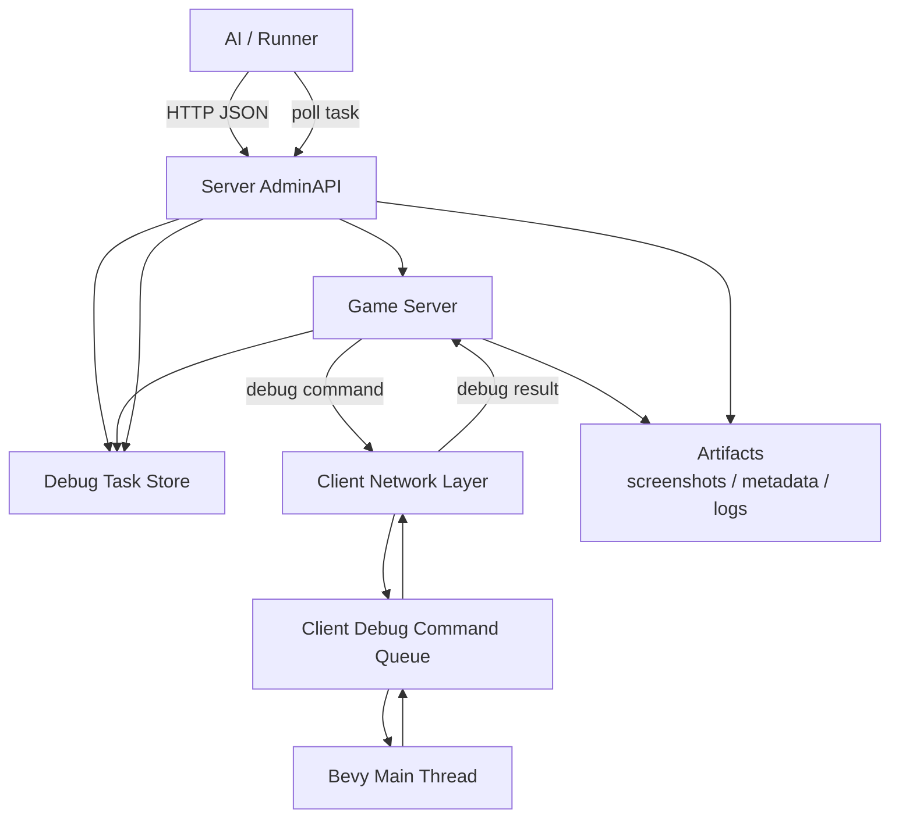

# 远程调试控制机制

本文档描述一套可被 UI 自动化审计和未来其他自动化功能复用的远程调试控制机制。该机制复用当前 server 架构：外部 AI 或 runner 调用 `adminapi`，server 通过 `game-server` 将命令下发给指定 client，client 在 Bevy 主线程执行命令并回传结果。

## 文档状态

本文是“协议约定 + 当前 runner 对接说明”。它是 `docs/ui/UI自动化审计与优化方案.md` 的下层依赖机制之一；UI 自动化审计负责定义 UI 截图、滚动、分析和修复流程，本机制负责提供统一、可审计、可扩展的远程命令通道。

当前仓库已经实现的是 `scripts/run-ui-audit.ps1` 的远程 Mock / Http runner：

- Mock backend：在 runner 内模拟 `adminapi` task store、任务状态推进、screenshot / metadata / client log artifact，可用于本地演示和报告验收。
- Http backend：按本文接口调用外部 `adminapi` 的 `POST /admin/debug/commands` 和 `GET /admin/debug/tasks/{task_id}`。

尚未在本仓库内实现的是真实 `adminapi`、game-server 下发链路和 client Bevy 主线程命令执行。也就是说，Http runner 是调用端，真实远程 server / client 能力仍是外部依赖。

## 目标

目标是建立一套安全可控的远程调试控制链路：

```text
AI / runner
  -> adminapi
  -> game-server
  -> client
  -> Bevy 主线程执行命令
  -> client 回传结果
  -> game-server
  -> adminapi 查询结果
  -> AI / runner
```

该机制应支持：

- 多设备、多 client、多会话。
- 移动端 client，不要求手机 App 自建 HTTP 监听。
- UI 自动化审计命令，例如截图、滚动、页面切换、读取 UI 状态、执行 recipe。
- 未来其他调试命令，例如场景状态读取、音频状态读取、调试 flag 设置等。
- 结构化任务状态、错误码、超时和重试语义。
- 安全鉴权、权限控制、命令白名单和审计日志。

## 非目标

本机制主要服务开发期、调试期、授权测试设备和 AI 自动化，不作为普通线上玩家功能。

第一阶段不要求复杂弱网兼容，不做离线任务长时间保活，不做公网穿透，不要求 client 暴露公网端口，也不允许通过该机制执行任意 shell 或访问任意本地文件。

## 总体架构



核心原则：

- `adminapi` 是外部唯一入口。
- `game-server` 负责定位在线 client 并下发命令。
- client 不自建 HTTP 监听，不暴露公网端口。
- client 网络线程不直接修改 Bevy ECS world。
- 所有 UI、场景、截图、滚动等操作必须进入 Bevy 主线程队列执行。

## 角色与职责

### AI / Runner

- 调用 `adminapi` 创建调试任务。
- 查询设备列表和任务状态。
- 读取截图、metadata、日志和错误码。
- 根据任务结果决定是否继续下发命令、分析截图或修改代码。

### AdminAPI

- 校验调用方身份和权限。
- 接收调试命令请求。
- 创建 task，生成 `task_id`。
- 处理 `request_id` 幂等。
- 校验命令白名单和 payload。
- 将命令交给 `game-server` 下发。
- 提供任务状态查询接口。
- 记录审计日志。

### Game-server

- 维护设备、玩家、房间或控制会话到 client connection 的映射。
- 将调试命令投递到指定在线 client。
- 接收 client 回传的执行结果。
- 更新 task 状态。
- 处理 client offline、send failed、client timeout 等状态。

### Client

- 接收 game-server 下发的调试命令。
- 校验当前是否允许执行调试命令。
- 将命令写入 Bevy 主线程可消费的队列。
- 在 Bevy Update 中执行命令。
- 生成结构化结果、错误和 artifact 引用。
- 通过既有网络连接回传结果。

## 设备与会话模型

调试命令必须明确目标。第一阶段建议支持以下定位方式：

```json
{
  "device_id": "android-test-01",
  "session_id": "optional-session",
  "client_id": "optional-client-id"
}
```

字段语义：

- `device_id`：授权测试设备或开发设备 ID。
- `session_id`：游戏内会话、房间、authority session 或 UI audit session，可选。
- `client_id`：server 当前连接层面的 client ID，可选。

如果多个字段同时存在，server 应按确定优先级解析，并在任务记录中写入最终绑定到的 client connection。

建议提供设备查询接口：

```http
GET /admin/debug/devices
GET /admin/debug/devices/{device_id}/status
```

设备状态至少包含：

```json
{
  "device_id": "android-test-01",
  "online": true,
  "client_id": "client-123",
  "platform": "android",
  "app_version": "0.1.0",
  "debug_control_enabled": true,
  "current_screen": "gallery",
  "last_seen_at": "2026-06-26T12:00:00Z"
}
```

## AdminAPI 接口

### 创建命令任务

```http
POST /admin/debug/commands
Authorization: Bearer <token>
Content-Type: application/json
```

请求：

```json
{
  "request_id": "ai-request-20260626-001",
  "device_id": "android-test-01",
  "session_id": "optional-session",
  "command": {
    "type": "ui.screenshot",
    "timeout_ms": 5000,
    "payload": {
      "label": "gallery-phone-small-top"
    }
  },
  "wait": {
    "enabled": false,
    "timeout_ms": 0
  }
}
```

返回：

```json
{
  "ok": true,
  "task_id": "dbg_task_001",
  "status": "accepted"
}
```

### 查询任务

```http
GET /admin/debug/tasks/{task_id}
Authorization: Bearer <token>
```

返回：

```json
{
  "ok": true,
  "task_id": "dbg_task_001",
  "request_id": "ai-request-20260626-001",
  "device_id": "android-test-01",
  "status": "succeeded",
  "command_type": "ui.screenshot",
  "result": {
    "width": 1080,
    "height": 2400
  },
  "artifacts": [
    {
      "kind": "screenshot",
      "uri": "artifact://debug/dbg_task_001/screenshot.png",
      "content_type": "image/png"
    },
    {
      "kind": "metadata",
      "uri": "artifact://debug/dbg_task_001/metadata.json",
      "content_type": "application/json"
    }
  ],
  "error": null
}
```

### 短等待模式

可以提供便捷的短等待模式：

```json
{
  "wait": {
    "enabled": true,
    "timeout_ms": 5000
  }
}
```

语义：

- `adminapi` 仍先创建 task。
- 如果任务在 `wait.timeout_ms` 内完成，直接返回最终结果。
- 如果未完成，返回 `202 accepted` 风格响应和 `task_id`。
- 调用方继续通过 `GET /admin/debug/tasks/{task_id}` 查询。

底层仍必须是异步 task 模型。短等待只是调用便利，不改变任务语义。

## UI 审计 Runner 实际调用

`scripts/run-ui-audit.ps1 -Remote` 当前只依赖两个 adminapi 端点：

| 动作 | 方法与路径 | 说明 |
| --- | --- | --- |
| 创建任务 | `POST /admin/debug/commands` | body 为统一命令请求，返回必须包含 `task_id` |
| 查询任务 | `GET /admin/debug/tasks/{task_id}` | 轮询到 `succeeded`、`failed`、`timeout` 或 `cancelled` |

Http backend 参数：

```powershell
.\scripts\run-ui-audit.ps1 -Remote -RemoteBackend Http `
  -AdminApiBaseUrl http://127.0.0.1:8080 `
  -AdminApiToken <token> `
  -DeviceId android-test-01 `
  -Screens ui-gallery `
  -States top
```

`-AdminApiToken` 非空时以 `Authorization: Bearer <token>` 发送。runner 创建任务时固定使用异步模式：

```json
"wait": {
  "enabled": false,
  "timeout_ms": 0
}
```

每个 request 会带稳定 `request_id`，格式由 run id、screen、target、state、命令序号和命令类型组合后转成安全路径片段。目标可以通过 `device_id`、`client_id`、`session_id` 任意一种或多种指定；多目标时这些列表长度必须一致，或者某个选择器只给一个值作为共享值。

## 为什么使用任务模型

一次 HTTP 同步请求不适合作为基础模型，原因包括：

- 截图是异步操作，需要等待后续渲染帧、GPU readback、保存或上传 artifact。
- UI 滚动、页面切换和 wait stable 都需要跨帧执行。
- client 收到网络命令后必须排队到 Bevy 主线程，不能在网络线程直接改 ECS。
- adminapi 到 client 中间经过 game-server 和移动端网络连接，同步等待容易变成长时间挂起和 HTTP 超时。
- HTTP 超时后，调用方无法判断命令是否已在 client 上执行了一半。
- 幂等和重试需要 `request_id` 和 `task_id` 承载，避免重复截图、重复点击或重复切页面。

推荐结论：

```text
底层统一使用异步 task 模型。
adminapi 可以提供短等待模式。
AI / runner 应以 task_id 查询为主。
```

## Game-server 下发协议

server 下发给 client 的消息建议使用统一 envelope：

```json
{
  "kind": "debug.command",
  "task_id": "dbg_task_001",
  "command_id": "cmd_001",
  "issued_at": "2026-06-26T12:00:00Z",
  "deadline_ms": 5000,
  "command": {
    "type": "ui.screenshot",
    "payload": {
      "label": "gallery-phone-small-top"
    }
  }
}
```

client 回传：

```json
{
  "kind": "debug.result",
  "task_id": "dbg_task_001",
  "command_id": "cmd_001",
  "status": "succeeded",
  "result": {
    "width": 1080,
    "height": 2400
  },
  "artifacts": [
    {
      "kind": "screenshot",
      "uri": "artifact-upload://dbg_task_001/screenshot.png",
      "content_type": "image/png"
    }
  ],
  "error": null
}
```

如果执行失败：

```json
{
  "kind": "debug.result",
  "task_id": "dbg_task_001",
  "command_id": "cmd_001",
  "status": "failed",
  "result": null,
  "artifacts": [],
  "error": {
    "code": "scroll_target_missing",
    "message": "scroll target gallery.main was not found",
    "retryable": false
  }
}
```

## Client 执行模型

client 侧必须分离网络接收和 Bevy 执行：

```text
game-server message
  -> client network layer
  -> DebugControlIncomingQueue
  -> Bevy Update system
  -> execute command on ECS world
  -> DebugControlResultQueue
  -> client network layer
  -> game-server
```

网络线程或网络回调只做：

- 解析 envelope。
- 检查基本格式。
- 将命令放入队列。
- 不直接访问或修改 Bevy ECS world。

Bevy 主线程负责：

- 页面切换。
- UI 滚动。
- 截图请求。
- UI tree、viewport、panel、focus 状态读取。
- 任务状态更新。
- 生成结果。

## 命令 Envelope

统一命令结构：

```json
{
  "type": "ui.scroll_to",
  "timeout_ms": 5000,
  "payload": {
    "target": "gallery.main",
    "position": "bottom"
  }
}
```

字段：

- `type`：命令类型，使用点分命名。
- `timeout_ms`：该命令的执行超时。
- `payload`：命令参数。

命令类型应可扩展，但必须走白名单注册。未知命令返回：

```json
{
  "code": "unknown_command",
  "retryable": false
}
```

## 任务状态机

建议 task 状态：

```text
accepted
queued
sent
running
succeeded
failed
timeout
cancelled
```

状态语义：

- `accepted`：adminapi 已接收并创建 task。
- `queued`：等待 game-server 下发。
- `sent`：已发送到目标 client。
- `running`：client 已确认开始执行。
- `succeeded`：client 成功完成并回传结果。
- `failed`：client 或 server 明确失败。
- `timeout`：超过 deadline 未完成。
- `cancelled`：任务被调用方或 server 策略取消。

状态转换应被记录到审计日志，便于排查设备、server 和 client 之间的问题。

## 首批命令清单

第一批命令围绕 UI 自动化审计：

| 命令 | 说明 |
| --- | --- |
| `system.health` | 检查 client 调试通道可用性 |
| `system.status` | 读取平台、版本、当前页面、调试模式状态 |
| `ui.goto_screen` | 切换到指定 `AppUiMode` 或 screen alias |
| `ui.wait_stable` | 等待 UI 页面和布局稳定 |
| `ui.screenshot` | 截取当前主窗口最终合成画面 |
| `ui.scroll_to` | 将指定滚动目标滚动到 top/middle/bottom 或百分比 |
| `ui.scroll_by` | 对指定滚动目标执行相对滚动 |
| `ui.read_viewport` | 读取 viewport、safe area、设备尺寸和方向 |
| `ui.read_panels` | 读取 panel stack 和 panel 元数据 |
| `ui.read_tree` | 读取 UI tree 摘要 |
| `ui.read_focus` | 读取焦点和输入状态 |
| `ui.run_recipe` | 执行一组预定义 UI audit recipe |

当前 UI audit runner 对每个 `screen + target + state` 实际按顺序发送以下命令：

| 序号 | 命令 | payload 关键字段 |
| --- | --- | --- |
| 1 | `system.status` | `audit`, `screen`, `state` |
| 2 | `ui.goto_screen` | `screen`, `requested_screen` |
| 3 | `ui.wait_stable` | `screen`, `state` |
| 4 | `ui.read_viewport` | `screen`, `state` |
| 5 | `ui.scroll_to` | `target`, `position`, `state` |
| 6 | `ui.screenshot` | `label`, `screen`, `state` |
| 7 | `ui.read_tree` | `screen`, `state` |
| 8 | `ui.read_panels` | `screen`, `state` |

其中 `ui_gallery` 的滚动 target 是 `ui_gallery.main`；其他 screen 暂按 `<screen>.main` 发送。`top` 对应滚动 `top`，`middle` 对应 `middle`，`bottom` 对应 `bottom`，`initial` 在远程 runner 中也会按 `top` 发送滚动命令。

后续可扩展：

| 命令 | 说明 |
| --- | --- |
| `ui.click` | 按 audit id 或坐标模拟点击 |
| `ui.input_text` | 向指定输入框写入文本 |
| `ui.open_panel` | 打开指定弹窗或覆盖层 |
| `ui.close_panel` | 关闭指定 panel |
| `scene.enter` | 进入指定场景 |
| `scene.read_state` | 读取场景状态摘要 |
| `audio.read_state` | 读取音频播放和 bus 状态 |
| `debug.set_flag` | 设置开发期调试开关 |

## UI 命令稳定 ID

远程自动化不能长期依赖坐标。坐标点击适合端到端输入路由验收，但不适合作为主要控制方式。

建议引入稳定 ID：

```text
UiAuditId
UiScrollAuditId
UiActionAuditId
UiInputAuditId
```

示例命令：

```json
{
  "type": "ui.scroll_to",
  "payload": {
    "target": "gallery.main",
    "position": "bottom"
  }
}
```

```json
{
  "type": "ui.click",
  "payload": {
    "target": "gallery.confirm_button"
  }
}
```

有了稳定 ID，AI 和 runner 可以执行可复现命令，而不是根据截图猜测坐标。

## Artifact 与截图结果

截图、metadata、日志等产物不应让 client 任意指定最终服务器路径。推荐由 server 分配 artifact location：

```text
artifact://debug/<task_id>/screenshot.png
artifact://debug/<task_id>/metadata.json
artifact://debug/<task_id>/client.log
```

`adminapi` 可以在任务创建时返回上传策略，或由 game-server 在下发 envelope 时带上 artifact 约束。client 只允许写入或上传到 server 允许的位置。

runner 当前识别的 artifact `kind`：

| kind | 用途 |
| --- | --- |
| `screenshot` | 截图 PNG |
| `metadata` | 截图元数据 JSON |
| `log` 或 `client_log` | client 侧执行日志 |

每个 artifact 推荐包含：

```json
{
  "kind": "screenshot",
  "uri": "artifact://debug/dbg_task_001/screenshot.png",
  "content_type": "image/png"
}
```

Mock backend 还会增加 `local_path` 并把文件写到 runner 输出目录下，便于本地演示。Http backend 不要求 `local_path`；如果只返回 `uri`，runner 会在 report 中记录 URI，但不会验证远程 artifact 的实际内容。

`ui.screenshot` 成功时必须至少返回 `screenshot` 和 `metadata` 两类 artifact URI。缺少任一项时，runner 将本次 capture 标记为 `artifact_upload_failed`。

截图结果至少包含：

```json
{
  "width": 1080,
  "height": 2400,
  "viewport": {
    "logical_width": 360,
    "logical_height": 800,
    "safe_area": {
      "left": 0,
      "right": 0,
      "top": 32,
      "bottom": 24
    }
  }
}
```

## 超时、重试和幂等

需要区分三个 ID：

- `request_id`：调用方请求 ID，用于 adminapi 幂等。
- `task_id`：server 创建的任务 ID。
- `command_id`：server 下发给 client 的命令 ID。

推荐语义：

- 相同 `request_id` 的重复请求返回同一个 `task_id`。
- 不同 `request_id` 总是创建新任务。
- `timeout_ms` 表示 client 执行 deadline。
- 任务超时后状态为 `timeout`。
- server 不自动重放非幂等命令，例如 click、input_text、goto_screen。
- 调用方如需重试，应显式创建新请求，并理解可能的副作用。
- 对读取类命令，例如 `ui.read_viewport`，可以标记为 retryable。

错误中应包含：

```json
{
  "code": "client_timeout",
  "message": "client did not finish command before deadline",
  "retryable": true
}
```

## 错误码

建议第一批错误码：

| 错误码 | 含义 | retryable |
| --- | --- | --- |
| `unauthorized` | adminapi 鉴权失败 | false |
| `forbidden` | 调用方没有调试权限 | false |
| `invalid_request` | 请求结构非法 | false |
| `unknown_device` | 目标设备不存在 | false |
| `device_offline` | 目标设备不在线 | true |
| `debug_disabled` | client 未启用调试控制 | false |
| `unknown_command` | 命令未注册或不在白名单 | false |
| `invalid_payload` | 命令参数非法 | false |
| `send_failed` | server 下发失败 | true |
| `client_rejected` | client 拒绝执行命令 | false |
| `client_timeout` | client 执行超时 | true |
| `screenshot_failed` | 截图失败 | true |
| `screen_not_found` | 目标页面不存在 | false |
| `panel_not_ready` | 页面 panel 未就绪 | true |
| `unstable_ui` | UI 稳定等待超时 | true |
| `scroll_target_missing` | 滚动目标不存在 | false |
| `scroll_target_unreachable` | 无法到达滚动目标位置 | true |
| `artifact_upload_failed` | 产物上传失败 | true |

当前 UI audit runner 会把以下远程错误码原样映射为失败类型：

| 错误码 | runner failure_type |
| --- | --- |
| `device_offline` | `device_offline` |
| `debug_disabled` | `debug_disabled` |
| `send_failed` | `send_failed` |
| `client_timeout` | `client_timeout` |
| `client_rejected` | `client_rejected` |
| `artifact_upload_failed` | `artifact_upload_failed` |

其他带 `error.code` 的失败会归类为 `remote_error`；状态为 `failed` 且无 code 时归类为 `remote_failed`；状态未知时归类为 `remote_status_unknown`；状态为 `cancelled` 时归类为 `cancelled`。runner 发起请求失败会生成 `adminapi_request_failed`，创建响应缺少 `task_id` 会生成 `invalid_response`。

Mock backend 支持用目标 ID 触发错误演示，例如 `-DeviceId mock-fail-client_timeout`。也支持用 `mock-artifacts-missing_metadata` 或 `mock-artifacts-missing_screenshot` 这类目标值演示截图任务成功但 artifact 缺失的报告路径。

## 安全边界

必须满足：

- `adminapi` 必须鉴权。
- 只有管理员、CI、授权 AI runner 或明确授权账号能调用。
- 命令必须按白名单开放。
- client 必须处于 dev/debug/audit 授权模式才执行命令。
- release 或正式线上包默认禁用调试控制。
- server 记录审计日志：调用方、时间、设备、命令类型、参数摘要、结果、artifact。
- 禁止通过该机制执行 shell。
- 禁止读取任意本地文件。
- 禁止写入任意本地路径。
- 禁止访问密钥、token、账号凭据或本地敏感配置。
- 高风险命令必须单独权限控制，例如 `debug.set_flag`、`scene.enter`、`ui.input_text`。

如果未来需要公网访问 `adminapi`，还需要额外考虑 IP allowlist、环境隔离、速率限制和命令审批。

## 与 UI 自动化审计的关系

UI 自动化审计是本机制的上层调用方。推荐调用方式：

```text
UI audit runner
  -> adminapi: system.status
  -> adminapi: ui.goto_screen
  -> adminapi: ui.wait_stable
  -> adminapi: ui.read_viewport
  -> adminapi: ui.scroll_to
  -> adminapi: ui.screenshot
  -> adminapi: ui.read_tree / ui.read_panels
  -> AI 分析截图和 metadata
  -> AI 修改代码
  -> 复跑审计命令
```

这样 UI 审计不需要关心 client 是桌面、Android 真机还是平板。它只依赖 `adminapi` 的统一任务接口和 artifact 结果。

当前 runner 生成的远程报告会关联：

- task 级：`screen`、远程目标、状态列表、`failure_type`、`task_ids`、screenshot artifact URI。
- capture 级：`screen`、远程目标、`state`、`screenshot_artifact_uri`、`metadata_artifact_uri`、`log_artifact_uri`、`remote_task_ids`、失败类型。
- analysis 输入：`analysis-input.json` 中引用对应 capture 的 artifact URI 和 `remote_task_ids`。

后续 `docs/ui/UI自动化审计与优化方案.md` 应引用本文档，避免在 UI 文档内重复定义远程命令通道。

## 分阶段落地

### 阶段 1：协议和任务模型

- 定义 adminapi 请求、任务状态、错误码和命令 envelope。
- 不接真实 client，先完成协议文档和 mock task store。

### 阶段 2：AdminAPI 基础接口

- 支持创建设备调试任务。
- 支持查询任务状态。
- 支持查询设备列表和设备状态。
- 支持 `request_id` 幂等。

### 阶段 3：Game-server 下发链路

- game-server 能向指定在线 client 下发 `debug.command`。
- 能接收 `debug.result` 并更新 task。
- 处理 device offline、send failed 和 timeout。

### 阶段 4：Client 命令队列

- client 接收 debug command。
- 只在授权 debug/audit 模式入队。
- Bevy 主线程消费队列。
- 支持 `system.health` 和 `system.status`。

### 阶段 5：基础 UI 读命令

- 支持 `ui.read_viewport`。
- 支持 `ui.read_panels`。
- 支持 `ui.read_tree` 摘要。
- 支持 `ui.read_focus`。

### 阶段 6：截图命令

- 支持 `ui.screenshot`。
- 截图结果生成 artifact。
- metadata 包含 viewport、safe area、panel 和截图尺寸。

### 阶段 7：页面和滚动命令

- 支持 `ui.goto_screen`。
- 支持 `ui.wait_stable`。
- 支持 `ui.scroll_to` 和 `ui.scroll_by`。
- 对滚动目标缺失和不可达给出明确错误。

### 阶段 8：Recipe 和 UI 审计接入

- 支持 `ui.run_recipe`。
- UI audit runner 改为调用 adminapi。
- 报告中关联 task、artifact、截图和 metadata。

### 阶段 9：扩展到其他自动化

- 扩展场景、音频、调试 flag、输入等命令。
- 按命令风险等级增加权限控制和审计。

## 最终验收标准

- AI / runner 可通过 `adminapi` 对指定在线 client 创建调试任务。
- client 不需要自建 HTTP 监听或暴露公网端口。
- server 能支持多设备、多 client 和移动端。
- 命令下发、执行、结果查询和错误返回语义清晰。
- `request_id` 幂等、`task_id` 查询和 `command_id` 下发语义清楚。
- 超时、重试和失败状态可被调用方正确识别。
- 调试命令只在授权模式执行。
- `adminapi` 鉴权、权限、命令白名单和审计日志齐全。
- UI 自动化审计可基于本机制完成页面切换、稳定等待、滚动、截图和状态读取。
- 后续其他游戏自动化功能可复用同一套任务和命令模型。

当前阶段的验收方式：

```powershell
.\scripts\run-ui-audit.ps1 -Remote -RemoteBackend Mock -DeviceId android-test-01 -Screens ui-gallery -States top
```

该命令应生成 `manifest.json`、`report.md`、`analysis-input.json` 和 `analysis.json`，并在 manifest/report 中能看到 mock `task_id`、`artifact://debug/.../screenshot.png`、`artifact://debug/.../metadata.json`、目标 device、页面和 state。真实 Http 模式只有在外部 `adminapi`、game-server 和 client 执行链路完成后才能按相同标准验收。
