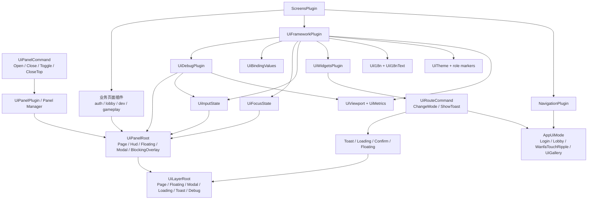

# UI 文档总览

这个目录记录当前自研 UI 框架的实现细节、运行机制、使用方式和已知限制。这里不记录阶段任务、开发流水或后续排期；需要判断框架现状时，以本目录和 `project/src/game/ui/` 的代码为准。

## 阅读顺序

- [UI框架整体架构.md](UI框架整体架构.md)：插件入口、目录边界、核心资源和系统关系。
- [UI模式与面板层级.md](UI模式与面板层级.md)：页面模式、Panel Manager、层级和关闭语义。
- [UI输入路由与焦点.md](UI输入路由与焦点.md)：输入阻断、焦点候选、键盘激活和滚动协作。
- [UI组件功能与使用.md](UI组件功能与使用.md)：文本、按钮、图标按钮、选择控件、数值控件、输入框和绑定。
- [UI响应式布局.md](UI响应式布局.md)：视口分类、指标推导、布局 helper、安全区和窗口验收。
- [UI主题字体与国际化.md](UI主题字体与国际化.md)：主题 RON、字体资源、i18n RON 和热更新机制。
- [UI覆盖层与弹窗.md](UI覆盖层与弹窗.md)：Toast、Loading、Confirm、Floating 的命令流和层级行为。
- [UI调试与验收.md](UI调试与验收.md)：F3 调试面板、窗口级验收命令和 Android 验收关注点。
- [UI当前限制.md](UI当前限制.md)：当前实现边界和使用时需要规避的点。

## 总览图

## 代码入口

- `project/src/game/screens/mod.rs`：注册 `NavigationPlugin`、`UiFrameworkPlugin` 和各业务页面插件。
- `project/src/game/navigation/mod.rs`：定义 `AppUiMode` 和 `RouteButton`。
- `project/src/game/ui/core/framework.rs`：统一注册 UI 框架插件。
- `project/src/game/ui/core/`：视口、层级、面板、输入、焦点、绑定、动画、统计。
- `project/src/game/ui/widgets/`：通用控件、布局 helper、滚动容器、图片 helper。
- `project/src/game/ui/overlays/`：Toast、Loading、Confirm modal 和路由命令处理。
- `project/src/game/ui/style/`：字体加载和主题 token。
- `project/src/game/ui/i18n.rs`：UI 文案加载、fallback 和热更新。

## 文档维护规则

修改 `project/src/game/ui/`、`project/src/game/screens/` 的 UI 结构、输入规则、主题资源、i18n 资源、窗口验收方式或 Android UI 行为时，需要同步检查本目录。文档应描述已经存在的机制和限制，不应写成待办清单。
