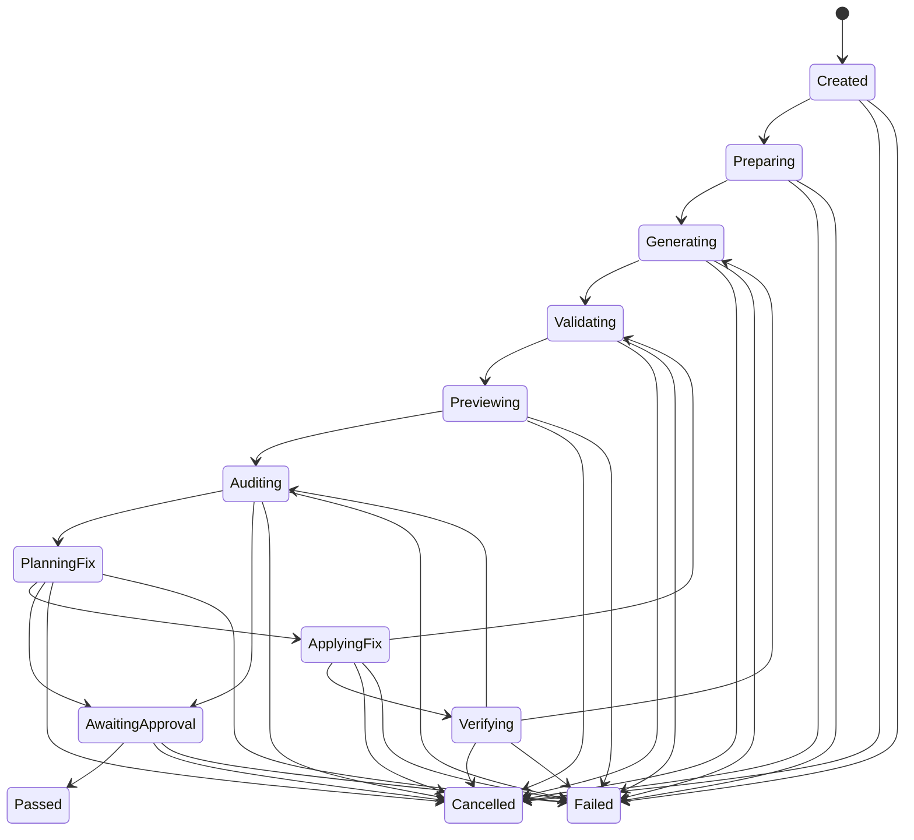

# UI 参考图生成与正式包边界

本文冻结“参考图 -> `UiDocument` -> 正式游戏页面”流程的工程边界。仓库当前已提供 Stage 1-11 `tools/ui-generation/` 独立工具、输入契约、工作目录规划、provider 无关调用协议、图片预处理、结构化视觉分析、确定性页面规划、素材策略、受控 `UiDocument` 生成验证、有限结构修复、独立进程预览、多状态/响应式审计、离线 `generate-fixture` 闭环、显式晋升、离线评测和受限可观测性。在线供应商/OCR/图片生成适配仍未实现，因此 `generate-fixture` 只能证明仓库自有结构化 fixture 的工程链路，不能冒充任意用户参考图的真实在线视觉分析。

## 目标

参考图生成流程用于在开发机或 CI 中分析图片、规划布局与视觉 token，并输出可验证的声明式 UI 草稿。页面主体是 `UiDocument` JSON，不是 AI 任意生成的 Rust 布局或业务实现。

正式交付遵循两条独立规则：

- 生成工具实现和未批准运行产物不进入正式游戏依赖图，也不随桌面或 Android 游戏包交付。
- 通过完整校验、素材授权检查和人工批准后明确晋升的 UI JSON、授权资源及必要注册适配属于正式游戏内容，会进入正式目录并随包交付。

“工具不入包”不等于“生成页面不入包”。隔离对象是生成期能力和未批准数据，正式页面仍由现有 `UiDocument` runtime 在游戏中加载。

## 规划目录和依赖方向

生成工具规划为独立 Rust 工具工程：

```text
tools/ui-generation/
  src/                  包含输入、目录、provider、预处理、分析、规划、素材策略、生成、修复、预览、run manifest、离线编排、评测和晋升
  assets/               工具侧只读、版本化的正式 UI asset ID metadata；不包含正式资源副本
  fixtures/             来源明确、允许公开提交的离线 fixture
  Cargo.toml            独立工具 crate，不属于 project workspace 或 target
  Cargo.lock            工具自身依赖锁定

summary/ui-generation/<run-id>/
  input/                原始输入和规范化输入说明
  analysis/             视觉分析、布局计划和不确定项
  draft/                未批准 UiDocument 草稿
  assets/               生成期或待授权素材
  preview/              预览截图和 metadata
  logs/                 脱敏日志
  manifest              输入、版本、hash、决策和产物关系

project/
  src/framework/ui/document/             正式 UiDocument 协议与 runtime
  assets/ui/documents/approved/           已批准、随包交付的 UI JSON
  assets/...                              已批准、随包交付的 UI 资源
  src/game/...                            必要 owner/route/registration 适配
```

`tools/ui-generation/` 已建立独立 Cargo 根。`inspect-task` 当前只严格解析任务、读取图片 bytes、核对声明 metadata/SHA-256、生成高影响问题和返回目录计划，不创建 `summary/ui-generation/`。该目录已由根 `.gitignore` 的 `/summary/*` 规则覆盖。工具自身的公开 fixture 可以提交到 `tools/ui-generation/fixtures/`，但不得为了测试把参考图、模型响应或生成期素材写进 `project/assets/`。除带明确来源说明的文本任务/provider fixture 外，`fixtures/acceptance/reference.png` 是唯一的二进制 acceptance 输入：它是仓库自有 CC0 fixture 的 analysis-only 副本，记录精确 hash/授权/来源并受 Git LFS 管理，只存在于工具工程，不属于 Android asset source set；其他图片 hash 测试仍使用临时目录。现有 `project/assets/ui/documents/fixtures/` 只服务于正式协议/runtime 自身的测试，不作为生成工具的运行目录。

依赖方向只能是：

```text
ui-generation tool -> project 暴露的最小稳定 UiDocument facade
project / Android / 正式构建 -X-> ui-generation tool
```

当前最小 facade 位于 `project::framework::ui::document::tooling`，只暴露协议模型、schema version、validation report、资源预算信息和 canonical JSON 能力。Stage 8 另提供 `ui-document-preview-tool` 非默认 feature 下的 desktop-only standalone preview binary；它只组合正式声明式 runtime/preview/screenshot 能力，不包含 provider 或生成器。provider SDK、图片解码/EXIF、prompt、视觉分析、修复、评测、调用成本和生成日志实现只属于工具工程，不能加入 `project/Cargo.toml` 的正式依赖图，也不能注册进 `UiFrameworkPlugin`。

工具当前提供以下输入、预处理和边界命令：

```powershell
cargo run --manifest-path tools/ui-generation/Cargo.toml -- inspect-task --task <task.json> --repository-root .
cargo run --manifest-path tools/ui-generation/Cargo.toml -- preprocess-task --task <task.json> --options <preprocess.options.json> --repository-root .
cargo run --manifest-path tools/ui-generation/Cargo.toml -- check-boundary --repository-root .
cargo run --manifest-path tools/ui-generation/Cargo.toml -- preview-document --document <document.json> --output-directory <new-output-dir> --repository-root . --width 390 --height 844
cargo run --manifest-path tools/ui-generation/Cargo.toml -- audit-document --document <document.json> --output-directory <new-output-dir> --repository-root . --states initial,loading
cargo run --manifest-path tools/ui-generation/Cargo.toml -- audit-document --document <fixture.json> --output-directory <new-output-dir> --repository-root . --states initial,loading --require-distinct-from-initial loading
cargo run --manifest-path tools/ui-generation/Cargo.toml -- evaluate-fixtures --catalog tools/ui-generation/fixtures/evaluation/catalog.v1.json --repository-root .
```

`check-boundary` 不在外层 `cargo run` 中再次启动 Cargo。它用 TOML parser 递归遍历所有普通、target、build、dev、optional、workspace 继承和 patch/replace 的本地 path 依赖，以 canonical manifest 路径检查完整的本地依赖可达性；同时检查两侧 `Cargo.lock` 的 resolved 本地包集合、祖先 workspace，以及 standalone preview target 是否由非默认 `ui-document-preview-tool` feature 和 `required-features` 双重隔离，避免直接依赖扫描漏过 `project -> middle -> ui-generation`，也避免预览工具进入默认桌面或 Android `--lib` 构建。

### Stage 11 离线端到端验收

阶段 11 的仓库内证据由 `pwsh -NoProfile -File scripts/run-ui-e2e-acceptance.ps1` 生成。脚本为 regular 与 complex 两个仓库自有 fixture 生成新的安全 run ID，复制输入到临时目录后运行 `generate-fixture`、四 profile (`phone-small`、`phone-portrait`、`tablet-portrait`、`tablet-landscape`) standalone audit、多状态 Modal/Loading fixture、exact self-reference integrity compare、受控失败演练与 worktree isolation self-test。临时输入在 `finally` 中删除；可复查证据、命令日志和 JSON/Markdown 报告保留在忽略的 `summary/ui-generation/<run>-report/` 和对应 run root。

该脚本只能调用 repository fixture provider，绝不读取凭据、调用在线 provider、adminapi 或远程设备。`ui-visual-audit` 的 config 会复制到每个受控 run root 后再比较，不能通过扩大 allowed-input root 绕过路径边界。Runner 使用 PowerShell 7 (`pwsh`)；Windows PowerShell 5.1 不能解析当前 Runner 的语法，不能作为验收宿主。

Android 真机截图和 metadata 不由该脚本伪造。即使主机存在 `adb`，在已批准的 Remote Http 链路能返回并验证 Android system-bar/safe-area、IME、touch、density/orientation、font、nine-slice 和 material fallback metadata 之前，报告必须保留 `external_blocked`。桌面 profile 只能证明声明式预览和布局策略，不能替代真实设备验收。

`inspect-task` 的输入是 `deny_unknown_fields` 的 serde JSON。它包含页面用途、主参考图、按显式 priority 排序的多状态/多尺寸/局部参考图、目标逻辑 viewport、可见文字、必须保留内容和允许修改范围。每张图声明原始尺寸、方向、色彩空间、SHA-256、来源与授权状态；Stage 1 只校验声明和文件 bytes/hash，不解码像素或推断 EXIF。缺失的装饰处理可确定性回落到项目主题，高影响的用途、文案、保留内容、修改范围、方向、色彩空间、授权和状态转换证据会进入结构化问题，目标 viewport 缺失则直接失败。

run ID 只允许安全的小写 ASCII 标识，不接受绝对路径、`..`、路径分隔符或 Windows 保留名。目录计划固定包含 `input/`、`analysis/`、`draft/`、`assets/`、`preview/`、`logs/` 和 `manifest.json`；已有目标和通过符号链接逃逸仓库的根会被拒绝。状态模型区分 pending、输入校验、ready、running、completed、failed 和 cancelled，取消是幂等终态且在图片读取边界检查。

## 闭环运行契约

`tools/ui-generation/src/run_manifest.rs` 提供 `ClosedLoopRunManifest`，作为后续生成、预览、视觉审核、受限修复和人工晋升 Runner 的唯一持久化状态契约。它不替换已由晋升流程读取的 sealed `UiGenerationRunManifest`；后者仍只表示已完成 Stage 3 产物的 bundle。闭环 Runner 目前尚未接入在线 provider，这份契约和其离线测试不代表在线生成或自动修复已经启用。

每份闭环 manifest 固定关联 generation input、reference manifest、可选 `UiDocument`、草稿 assets、preview、comparison、analysis、fix 和 approval artifact。每个 link 使用受限相对路径、SHA-256 和字节数，重复路径或不安全链接都会使 manifest 损坏。provenance 同时记录工具版本、源提交、模型、prompt、schema、算法、viewport、theme、locale 及全部硬预算，不能用运行时默认值替代这些可追溯输入。

### 隔离工作区和恢复边界

闭环 Runner 在进入 `Preparing` 前还必须将一次 `workspace` record 绑定到 `ClosedLoopRunManifest`。只生成草稿的 run 使用 `summary/ui-generation/<run-id>/staging/`，并且只能写入显式允许的草稿根；允许页面代码升级的 run 使用 `summary/ui-generation/<run-id>/worktree/` 下从记录的 source commit 创建的 detached Git worktree。两种模式都会记录 source commit、原调用者工作树是否 dirty、porcelain 状态摘要 hash、允许修改根、初始文件 hash 快照、锁目标和每个锁的唯一 lease identity。dirty 状态只作为审计证据，绝不复制为 staging/worktree 的隐式输入。

每次修复 iteration 都必须在允许根内采集 before/after SHA-256 文件快照，并以 `created`、`modified`、`deleted` 三类结构化 diff 保存。路径解析会拒绝绝对路径、`..`、symlink/reparse point 和越过允许根的输出。`run-ui-audit.ps1` 的 `FixMode Command` 也会从记录的 source commit 创建并保留本 iteration 的 detached worktree，在该 worktree 中执行命令和验证；调用者当前工作树只接收 run artifact，不接收自动修复。Runner 不得对用户当前工作树调用 reset、clean、覆盖 checkout、worktree remove 或递归删除。

同一页面、正式资源或 worktree 目标通过 `summary/ui-generation/.locks/` 的 no-clobber lock 串行化。每个 lease 的释放和续约都必须比对 target、owner run ID 和唯一 lease identity；旧 handle 因而不能删除同 run ID 后续恢复得到的新 lease。Runner 必须在长外部调用的有界边界调用 `refresh_locks` 续约，过期 lease 不得复活。过期回收由同 target 的 OS file-lock guard 串行化，崩溃时 guard 由 OS 释放；无法获取 guard、读取记录或精确匹配时保持 fail-closed，绝不删除锁。正常取消只释放本 run 自己的锁，保留 staging/worktree 和最后完整快照；进程崩溃或机器重启后，后续 run 只能在锁 TTL 到期并复验 lock identity 后单文件回收过期 lock。工具不会自动递归清理任何 run 目录，artifact 保留和受控清理由后续阶段单独处理。



| State | 允许前序和进入证据 | 持久化字段 | 超时 / 重试 | 终态 |
| --- | --- | --- | --- | --- |
| `Created` | 新建 manifest；generation input 和 reference manifest 已绑定 | 创建时间、provenance、artifact links、初始 cache key | 不适用 / 否 | 否 |
| `Preparing` | `Created` | checkpoint 时间、cache key、attempt | 60 秒 / 最多 3 次（含首次） | 否 |
| `Generating` | `Preparing` 或需重新生成的 `Verifying` | checkpoint、生成调用 cache key | 300 秒 / 最多 3 次（含首次） | 否 |
| `Validating` | `Generating` 或 `ApplyingFix`；必须已有 `UiDocument` | checkpoint、document link | 60 秒 / 最多 3 次（含首次） | 否 |
| `Previewing` | `Validating`；必须已有 `UiDocument` | checkpoint、preview 调用 cache key | 300 秒 / 最多 3 次（含首次） | 否 |
| `Auditing` | `Previewing` 或 `Verifying`；必须已有 document 和 preview | checkpoint、审核调用 cache key | 300 秒 / 最多 3 次（含首次） | 否 |
| `PlanningFix` | `Auditing`；必须已有 comparison 和 analysis | checkpoint、fix-plan cache key | 60 秒 / 最多 3 次（含首次） | 否 |
| `ApplyingFix` | `PlanningFix`；必须已有 fix plan | checkpoint、修复调用 cache key | 120 秒 / 最多 3 次（含首次） | 否 |
| `Verifying` | `ApplyingFix`；必须已有 fix plan | checkpoint、验证 cache key | 300 秒 / 最多 3 次（含首次） | 否 |
| `AwaitingApproval` | `Auditing`、`PlanningFix` 或 `Verifying`；必须已有 document、preview、comparison、analysis | checkpoint、人工审批等待记录 | 7 天 / 否 | 否 |
| `Passed` | `AwaitingApproval`；必须额外有 approval artifact | 完成 checkpoint | 不适用 / 否 | 是 |
| `Failed` | 任一非终态；必须带共享 `TaskFailure` | failure、完成 checkpoint | 不适用 / 否 | 是 |
| `Cancelled` | 任一非终态；必须带取消原因和时间 | cancellation、完成 checkpoint | 不适用 / 否 | 是 |

每次状态进入都保存 cache key、attempt、进入/完成时间；成功 state 只在完成 checkpoint 后可作为恢复点。恢复输入必须以精确 checkpoint identity（`checkpoint_index + state + attempt`）关联每个当前计算出的 cache key，不能以 state 名称作为 key，因为一次修复循环会重复 `Validating`、`Previewing`、`Auditing` 等 state。Runner 从最近一个连续、完整且 identity/key 都相等的 checkpoint 继续；只有 cache key 未变化的已完成 `Generating`、`Previewing`、`Auditing` 或 `ApplyingFix` 外部调用可以复用。任一较早或后续循环中的 key 变化都会从该精确 checkpoint 重新开始，不能跳过它或回退到同名的首个 checkpoint 而混用旧 artifact。每个可重试状态最多三次（包含首次），耗尽时恢复被拒绝，由 Runner 以该失败持久化终态记录；恢复后的新 attempt 必须先持久化 manifest，再启动外部工作。

生成工具、审核 Runner 和后续闭环 Runner 都以 `TaskFailureKind` 作为统一失败分类。已有 PowerShell audit 的 `manifest_invalid`、`ai_blocking_issue`、`safety_policy_rejected`、`fix_check_failed` 等稳定 `failure_type` 可映射到 manifest、审核、安全策略和验证失败；未知外部字符串不得静默重命名。manifest 损坏、协议版本不兼容、非法跳转和取消晚于 `Passed` 都必须 fail-closed，不得改变已完成审批结果。

Stage 2 的 provider 协议用 `visual_analysis` 和 `structured_generation` 两种供应商无关请求隔离模型名称、SDK 请求和原始响应。请求、图片 bytes、prompt 和结构化输入没有序列化实现；普通 trace 只允许记录 run/prompt/schema 版本、图片数量/总字节数、尝试结果、耗时和经过字符校验的服务端 request ID。统一 runner 强制单次超时、外部取消、本地最小请求间隔和最多 10 次的有限重试，并只重试 timeout、rate limit 和 service unavailable。每个调用链还可以共享 `TaskBudget`：它在每次尝试前硬性限制调用次数、累计图片数和总耗时，并在 provider 返回 usage 后限制输入/输出量与按配置估算的微单位成本；任一上限到达即停止，不能靠 repair 或重试扩大额度。凭据只由环境变量或注入的系统安全存储读取，secret 的 `Debug`/`Display` 恒为 `[REDACTED]`。当前没有在线供应商 SDK 或网络适配；离线 `FixtureProvider` 和 `MockProvider` 用于本地与 CI。

Stage 3 的 `preprocess-task` 只接受内容识别为 PNG/JPEG、编码体积不超过 64 MiB、单边不超过 16384 px 且解码像素不超过 2400 万的参考图。工具读取编码尺寸、原始/解码色彩类型、alpha、EXIF 方向和 ICC profile 的长度/hash；任务声明方向与实际 EXIF 冲突会失败，无 EXIF 时才使用已确认的任务声明。标准副本固定输出确定性 RGBA8 PNG，但当前不执行或声称未经验证的 ICC 色彩转换，manifest 会同时保留声明色彩空间和嵌入 profile 证据。

裁切、安全区和系统 UI 排除区均来自严格 options JSON，坐标统一使用完整 EXIF 归一化图的左上原点像素边界，不根据内容猜测。每张参考图最多允许 64 个系统 UI 排除区，超限在解码和绘制前失败，避免 options 放大辅助图绘制成本。manifest 明确记录原图像素、EXIF 归一化像素、预览像素、目标 logical px 和 device physical px 的尺寸、比例、裁切偏移与舍入规则；Raw 与 EXIF 空间保留全图往返，预览、logical 和 physical 空间只接受 crop 内坐标。超大图按固定 max edge/像素预算等比缩小，同时保留原尺寸和映射。网格、区域编号和高对比图是带 `auxiliary_only` 的独立 artifact，不能替代原图或标准预览作为后续证据。

预处理 cache key 绑定输入 SHA-256、预处理协议/实现版本、声明 metadata、reference ID、目标 viewport、页面/局部验证 profile 和全部输出选项。cache 与 run 都先写同卷 staging 目录再 rename，已有 run 不覆盖，损坏 cache 不静默复用；所有输出固定在被忽略的 `summary/ui-generation/` 下。页面/状态/viewport 参考图会拒绝无可见变化的空白页；局部 detail 允许纯色素材，避免把合法色块误判为空白。Stage 11 的分析结果 cache 另位于同一被忽略根的 `.cache/analysis/`：key 精确绑定输入 SHA-256、model ID、prompt version、schema ID/version 和受限参数 JSON；只保存正式 Schema/语义已通过的结构化分析，不保存图片、prompt、credential 或原始 provider envelope。任何复用参数变化都会产生新 key；仅 `AnalysisCache::invalidate` 的精确 identity 删除可以使既有条目失效，工具不会静默清除或跨 key 复用。

Stage 4 的 `UiReferenceAnalysis` 只存在于工具 crate，是独立于正式 `UiDocument` 的不可信中间协议。每份分析绑定 reference ID、原图 hash、预处理 cache key、manifest hash、标准预览 hash/尺寸和明确的 `standard_preview_pixel` 左上原点坐标语义；区域和元素的 bounding box 不能脱离这些证据单独出现。元素图记录单根父子层级、区域、视觉种类、固定锚定/内容流/比例伸缩/滚动/绝对装饰布局行为、对齐线索、重复模式、候选组件、置信度和可回指 reference 区域、provider request ID 或人工输入的证据。纯 Schema/语义解析只证明输出内部一致，不赋予来源信任；provider 集成必须使用 `ProviderExecution` 的实际 provider ID、response request ID、request prompt version、原始 `GenerationTask` 和 Stage 3 manifest 证据构造不可反序列化的 trusted context，并逐项交叉校验。provider 未返回 request ID 时不能建立可追溯分析来源，集成校验会明确失败。

分析协议单独保留 OCR/model 原始文字候选、候选置信度、人工文字、`human_input_id` 和采用策略。可信人工输入由 `GenerationTask.visible_text` 按顺序确定性派生为 `task.visible_text.XXXX -> text`，分析中的人工文字必须绑定该 ID、通过元素 evidence 链接，并与 trusted context 中的原文逐字相同；模型自填一组互相匹配的文字和 human evidence 仍会被集成校验拒绝。人工文字存在时必须保持权威；冲突必须产生关联的 `text_conflict` uncertainty。遮挡、模糊、裁切、未知字体和隐藏交互都有显式、可关联的 uncertainty 类型，不得通过模型默认值静默消失。Rust 类型通过 `schemars` 生成 Draft 2020-12 JSON Schema，输入先受 2 MiB、结构深度、节点和字符串预算约束，再执行 Schema 与语义校验；语义阶段检查 ID 唯一性、单根无环图、最大 24 层、坐标边界、引用闭包、重复序号和文字权威性。公开预算常量由生成 Schema 的精确 constraint 测试和边界值测试共同锁定。Stage 4 分析 API 当前只用仓库自编 fixture/Mock 验证协议，不调用真实 OCR/在线模型，并且自身只产出 `UiReferenceAnalysis`；离线 `generate-fixture` 会在后续 Stage 5-8 消费该分析并生成 `UiDocument`。

## 产物分类

| 内容 | 生成期位置 | 能否进入正式目录 | 是否随正式包交付 |
| --- | --- | --- | --- |
| Provider、图片预处理、prompt、分析、修复、评测和成本代码 | `tools/ui-generation/` | 否 | 否 |
| 原始参考图、模型原始响应、日志、草稿、source map、生成期素材 | `summary/ui-generation/<run-id>/` | 默认禁止 | 否 |
| 公开离线 fixture | `tools/ui-generation/fixtures/` | 仅留在工具工程 | 否 |
| 已批准 `UiDocument` JSON | 晋升前位于 run draft | `project/assets/ui/documents/approved/` | 是 |
| 已授权并批准的图片、字体和其他 UI 资源 | 晋升前位于 run assets | 对应 `project/assets/` 正式目录 | 是 |
| 经审阅的 i18n/theme 变更 | 由晋升计划生成 | 对应正式配置目录 | 是 |
| 确定性 owner/route/registration 审阅声明 | 由封闭模板生成 | 已批准页面目录内的 `promotion.v1.json` | 是，供受控游戏层适配审阅和注册 |

生成期 source map 用于把参考图证据、分析元素、草稿节点和预览结果关联起来，默认保留在 run 目录，不作为正式资源打包。晋升后的 `UiDocument` 仍保留稳定 document/node ID，并继续通过既有 validation report 与 audit metadata 定位正式页面问题。

## 生成和验证流程

规划流程按以下顺序执行：

1. 工具读取参考图和用户输入，在隔离 run 目录记录 hash、来源、授权状态和目标 viewport。
2. Provider 和本地处理步骤生成结构分析、布局计划、token 候选、素材计划与不确定项。
3. 工具输出 `UiDocument` JSON 草稿、source map 和必要的素材候选，不直接修改 `project/`。
4. 草稿依次通过 JSON Schema、语义、能力、action/binding、资源来源和预算校验。
5. 工具通过独立、显式 feature-gated 进程复用现有声明式 preview/runtime，等待文档 commit、字体和图片资源就绪及稳定帧后截图；生成器和 provider 不进入正式插件。
6. 人工处理高影响不确定项、授权问题、未知业务行为和框架能力缺口。
7. 只有验证和批准均完成的 run 才能进入受控 `promote` 流程。

参考图只能证明可见状态。隐藏交互、业务权限、响应式规则和不可见页面状态不能由模型静默猜测；无法由白名单能力表达的内容必须保留为阻塞问题或人工工作项。

## 多状态与响应式证据

Stage 7 的单图生成请求继续拒绝非空 `states` 和 `responsive`，不能因为后续能力出现而放宽该门禁。Stage 9 只为有额外可信输入的同页参考图提供独立的 `PageSeriesEvidence` 校验：它要求 task 中声明的 `state`/`viewport` 附加参考、Stage 4 analysis 中对应 reference-region evidence，以及将附加参考元素映射回主参考稳定节点的共享 source map。正式文档只能包含该矩阵逐项声明的 state 和 responsive override，不能为每张图复制一份页面，也不能由模型补造未见状态。

有两个以上不同 viewport 的可信参考时，responsive variant 才可以标记为 `observed`；只有主 viewport 时，允许使用项目既有尺寸分类作为 `project_default`，并在输出中写入假设。可见 `loading`、`empty`、`error`、`selected`、`disabled`、`modal` 等状态只有在各自 reference 中出现且能够由现有 `UiDocument` layout/style 或控件状态协议表达时才进入草稿。没有可见证据的状态保持未实现，不产生视觉伪造。

工具不会把参考图中的按钮外观变成业务 Rust 或开放 action/binding。当前没有受主机注册表确认的默认本地 action 时，交互一律标为 `SERIES_ACTION_UNBOUND`。可访问性补充复用正式控件协议：已有 label/title slot 作为 accessible label 来源、按稳定节点顺序生成键盘焦点顺序、显式 44 logical px 最小尺寸或现有 runtime component minimum 作为触控目标策略；它不改变主参考视觉结构。

`audit-document` 在一个新的输出目录内调用 feature-gated standalone declarative preview，为 `ui_document_preview × phone-portrait/tablet-landscape × 每个显式 state` 生成 PNG、严格 preview metadata 和 `audit-manifest.json`。`--require-distinct-from-initial` 是 fixture 的显式视觉契约：只对列出的状态检查截图 hash 必须不同于 initial，并将不满足的格子写入 manifest；它不把所有业务状态都误判为必须视觉不同。standalone preview 固定为声明式 Page panel，因此 `UiNode::Modal` 的画面可审计，但 Modal panel 的输入阻断和 owner cleanup 仍由正式 runtime 测试验证。该工具不能路由或加载游戏业务页面，不写入 `summary/` 以外的目录，不构成审批或晋升。底层 standalone preview 新增 `--page-state <closed-state-id>`，仍只在 `ui-document-preview-tool` 非默认 feature 下编译；默认桌面、Android `--lib` 和 `UiFrameworkPlugin` 不包含生成器、provider 或审计工具。

## 受控晋升

`promotion-decisions`、`record-promotion-decisions`、`promotion-plan` 与 `promote` 形成受控晋升链。普通分析、生成、修复、预览和评测命令不得写入 `project/src/`、`project/assets/` 或 approved 目录；只有 `promote` 能写入正式目录，且它不会写 `project/src/`。

`promotion-decisions` 仅从已有 `summary/ui-generation/<run-id>/bundle/manifest.json` 生成少量高影响问题：低置信度/歧义核心布局、未确认素材授权、隐藏业务动作、框架能力缺口以及最终 release approval。每个问题包含可回指的 reference/region/element、候选处理方案和影响；决定类型固定为接受、拒绝、替换素材、修改文字、修改约束或保持占位。`record-promotion-decisions` 会重新读取 sealed bundle，复算 `COMMITTED` manifest hash、所有 stage/bundle artifact hash、canonical document hash 和 generation input hash；只有全部绑定一致且每个问题都有结构化理由的决定才能以 append-only `approval/promotion-decisions.v1.json` 与 hash marker 写回同一 run。手写或过期的 manifest、变更后的草稿、伪造的 input/document hash 和第二次覆盖记录都会失败。

`promotion-plan` 是纯读取命令，输出待写入的 document JSON、资源、registration 审阅声明、空或显式的 i18n/theme/action/binding 改动以及所有 ownership conflict。`promote` 必须收到该计划的精确 `plan_sha256`，执行时会重新生成计划和目标检查；计划 hash 不匹配、批准被拒绝、需要重新生成的替换/文字/约束决定、未保持占位的未知业务/框架能力、未知 action/binding/i18n 字段或不兼容 schema 都会阻止写入。

每个新页面占用唯一的 `project/assets/ui/documents/approved/<document_id>/` 目录，包含 canonical `document.v1.json` 和封闭 `promotion.v1.json` registration 审阅声明。声明只含 approved source root、相对路径、document ID、owner、route、page/layer、initial page state 和固定 audit profile；i18n/theme/action/binding 列表必须显式为空，不能借字符串生成 Rust 类型、系统、网络调用或业务行为。owner、route、document ID、目标目录和既有 approved registration 均会在写入前扫描，任何冲突均 no-clobber 失败。

需要正式二进制资源时，人工提交的资源声明必须精确引用 sealed run 的 `draft_assets` artifact，匹配授权裁切或明确许可的生成策略、源 hash/大小、Android 质量规格与 document 内唯一的 `ui/documents/approved/<document_id>/assets/...` packaged path。目标扩展名必须被根 `.gitattributes` 的 `project/assets/**` Git LFS 规则覆盖。工具将资源、`catalog.v1.json` fragment 和 `LICENSES.md` 记录一并写入同一 approved 页面目录；Stage 6 catalog 会加载并验证每个 fragment，继续保持完整路径、hash、license、尺寸和 alpha 覆盖。页面包从同卷 staging 以单次目录 rename 原子提交，失败不会留下部分 document、资源、catalog 或 license record，也永不覆盖已有页面或资源。

晋升必须满足以下前置条件：

- run manifest 完整，输入、模型、prompt、schema、参数、hash、修复轮次和人工决定可追溯。
- 最终草稿通过 Schema、语义、能力、action/binding、资源和预算校验。
- 所有高影响不确定项已有明确决定；拒绝、未知授权和未知业务行为不能被默认接受。
- 目标文件、页面 owner、document ID、route 和资源 ID 的所有权明确。
- 目标 schema version 可由当前正式 runtime 读取，canonical hash 与待晋升内容一致。

`promote` 在写入前必须输出完整、可审阅的变更计划，至少列出：

- 将写入 `project/assets/ui/documents/approved/` 的 JSON。
- 将写入正式 assets 的每个资源、目标路径、hash、许可证和 Git LFS 规则。
- i18n key、theme token、owner、route、page registration 和 action/binding 注册要求。
- 与现有文件、ID、页面所有权或 schema 的冲突。
- 不会进入正式目录的 run 产物。

显示计划后必须获得显式确认，不能把模型成功、校验通过或先前的普通运行确认当作晋升授权。实现应先在临时目录构造完整结果并复验，再以事务方式落盘；任一步失败都必须回滚，不得留下部分 JSON、部分资源或未配套注册代码，也不得覆盖计划外文件。

## Rust 适配边界

页面结构、样式和控件树由 `UiDocument` JSON 表达。当前晋升仅从封闭、版本化模板产生 owner、route 和 registration 审阅声明；正式 `project` 的 `document::tooling::parse_approved_document_registration` 会以只读闭合 schema 解析该声明，并拒绝 i18n、theme、action 和 binding 注册。游戏层需要在自身 route lifecycle 中显式调用 `to_preview_registration` 才会把声明转换为现有的运行时/预览注册；`route` 只是供人工审阅的标签，adapter 不会执行它。该 adapter 保持在默认 `project --lib` 内，不依赖工具 crate；游戏接入仍必须作为正常、可审阅的人工 Rust 改动完成，不能由工具或模型写出任意业务代码。

工具和模型不得：

- 生成任意 Rust 业务 system、命令处理器、网络调用或权限逻辑。
- 通过字符串指定 Rust 类型、函数、system、message 或反射组件。
- 为绕过校验自动扩大 action/binding allowlist 或资源预算。
- 猜测不存在的业务 action、binding path、owner 或 route。

未知 action 或 binding 必须阻塞晋升。开发者应先在游戏层实现并注册受控业务能力，再重新校验文档。即使模板适配已经晋升，正式 runtime 仍要执行现有 action、binding、owner、资源和预算检查。

## 素材、隐私和安全

- 未确认许可的参考图只能用于本地分析，不能裁切后晋升为正式资源。
- 每个候选资源都要记录来源、原图 hash、裁切或生成步骤、许可证、批准决定和最终 hash。
- 二进制正式资源继续遵守仓库 Git LFS 规则；文本 JSON、RON 和授权说明按现有约定提交。
- 凭据只从环境变量或系统安全存储读取，不写入 prompt 快照、manifest、普通日志或正式资源。
- 日志与报告要对账号文字、个人信息、访问令牌和 provider 敏感内容脱敏。
- 模型输出始终是不可信输入，structured output、人工批准和 `approved` 路径都不能替代正式 runtime 校验。

## CI、安全与权限门禁

`tools/ui-generation/fixtures/ci/ui-ci-security-policy.v1.json` 和
`ci-security-fixture` 固化五种运行模式：本地开发、PR Fixture、PR 确定性审核、手动在线生成契约、定时在线审核契约。前三种均为离线模式，不读取在线凭据、不调用网络、不访问远程设备；`pull_request` checkout 也不持久化凭据，因此外部贡献和不受信分支不能提升为 provider 或设备任务。

当前手动与定时工作流仅在受保护的 `ui-audit-online` environment 中验证在线前置条件，`execution = contract_only`。它不引用 secret、不调用 provider、不上传参考图、不启动 Android 或其他远程设备。未来真实在线适配必须经过单独审阅，且只能使用 provider API 最小凭据、明确的 allowlist 域名和 600 秒以内的调用超时；用户参考图只可发送给已批准 provider。`provider.example.invalid` 是当前无网络占位 allowlist，不能当成可用服务。

PR 只读工作流会对 `tools/ui-visual-audit/fixtures/references/`、baselines、masks 和 thresholds 的改动要求 `ui-reference-baseline-approved` 标签。自动化不得提交、push、创建 release 或修改分支保护。失败时 CI 只上传由 `write-ui-ci-failure-report.ps1` 生成的最小 redacted JSON，保留 14 天；该 artifact 不含凭据、账号、参考图/bytes、截图或原始模型输出，具体诊断仍在受控 CI 日志中。

`test-ui-supply-chain.ps1` 对两个 Cargo lockfile 拒绝 git source 和无 checksum 的 registry 包，并检查生成资源许可、模型输出人工审批、未信任 shader 禁止执行和 artifact policy。CI policy 同时记录离线 20 分钟、在线契约 15 分钟、512 MiB cache、32 MiB artifact 和 14 天保留的配额。所有这些检查可本地运行；它们不证明在线 provider、OCR、图片生成或远程 Android 已可用。

## 评测、成本和报告

`tools/ui-generation/fixtures/evaluation/catalog.v1.json` 是小型、来源明确的离线评测集。它只引用仓库自有的 CC0 合成文本 fixture，覆盖登录、列表、HUD、弹窗、复杂美术面板，以及 phone/tablet 多尺寸多状态页面。每个 case 都在 catalog 中记录期望组件、关键区域、允许差异、明确不支持能力、目标 viewport/state 和 reviewer-role-only 人工验收结果。它不是用户参考图、商业素材或线上模型能力的替代证明。

`evaluate-fixtures` 对每项输入重跑 formal analysis 或 `UiDocument` 校验，并为每例调用一次离线 `FixtureProvider`；输出只含 case ID、通过/失败、首次校验、repair 轮数、耗时和稳定 failure code，以及全量成功率、首次校验通过率、repair 总数、调用数、输入/输出 units 与估算成本。它不输出 prompt、图片 bytes、可见账号/个人文本、原始模型响应或凭据。任何需要写入 JSON 的日志/报告必须先经过 `redact_report_value`：credential/token/password、账号标识、email/phone、visible content 和 raw model fields 采用完整 `[REDACTED]` 替换，而不是部分掩码。

线上 provider 验收必须单独记录 provider、模型、价格版本、人工审批和受限运行 ID；它不属于普通 `cargo test`、CI 或正式游戏构建前提。本仓库当前没有在线 SDK、凭据或网络测试，因此离线 fixture 是唯一可重复的默认评测链路。

## 正式构建隔离验证

后续实现验收不能只依赖 Rust dead-code elimination。至少应提供以下证据：

- `check-boundary` 的结构化 manifest/path 完整可达图和 lockfile 检查证明 `project` 不包含 `tools/ui-generation`，且工具单向可达 `project`；发布验收仍可用 `cargo metadata`/`cargo tree` 交叉确认 provider、图片预处理和评测专属依赖未进入正式图。
- `project/Cargo.toml`、Android 壳和正式构建脚本没有反向引用工具 crate，也没有通过默认 feature 或隐式 workspace 把工具带入构建。
- 正式桌面构建和 Android `cargo ndk ... --lib` 只构建游戏 target；构建记录中没有生成工具 target。
- 包内容不包含原始参考图、模型响应、run 日志、草稿、source map 或工具 fixture。
- 已晋升 JSON、授权资源和必要注册适配能由正式游戏加载，并在桌面与 Android 包中按预期交付。

提交或发布验收至少保留以下命令的输出记录，且正式项目命令必须显式使用 `project/Cargo.toml` 和 `--lib`，不能使用 `--all-features` 或从工具 crate 继承 workspace 设置：

```powershell
cargo metadata --manifest-path project/Cargo.toml --format-version 1 --no-deps
cargo tree --manifest-path project/Cargo.toml --edges normal
cargo check --manifest-path project/Cargo.toml --lib
Set-Location project
cargo ndk -t arm64-v8a -P 26 -o ..\android\app\src\main\jniLibs rustc --release --lib --crate-type cdylib
```

前两项和 `check --lib` 是无需 Android SDK 的可复验依赖/桌面证据。最后一项是 Android NDK 已安装时的正式交叉编译证据；缺少本机 NDK、SDK 或 `cargo-ndk` 时必须明确记录为环境限制，不能伪造成功或把工具 feature 带入 Android 命令。上述输出与 `check-boundary` 共同证明工具 crate、image/jsonschema/provider/评测专属依赖均不在 `project` 的正式依赖图中。

## 与预览和视觉审核的关系

Stage 8 通过 feature-gated standalone binary 复用 [UI声明式预览与热更新.md](UI声明式预览与热更新.md) 中现有的安全 source、事务 reload、状态迁移和截图能力，只能由开发工具显式启动，不能把 provider 或 generator 注册进正式 `UiFrameworkPlugin`。预览成功也不会构成晋升批准或改变草稿的不可信状态。

本轮设计负责从参考图生成可验证的 `UiDocument` 及其受控晋升。参考图与渲染结果的视觉相似度判定、差异分区和审核阈值属于本地后续开发计划 `04_UI参考图视觉审核_checklist.md`，不能用“能够预览”替代视觉审核通过。

## 当前状态

### Stage 5 规划协议

`tools/ui-generation/src/planning.rs` 将已通过 Stage 4 校验的分析结果转换为有预算、顺序稳定的页面规划。它聚类可见几何得到字号、间距、重复尺寸、圆角和边框候选，按重复 pattern 保留组件实例到参考元素的 source mapping，并输出父子、尺寸、锚点、对齐、间距、伸缩和滚动约束。计划步骤固定按结构、视觉、装饰排序。

规划器通过 `UiDocument` tooling facade 的只读 catalog 匹配现有 theme token 和正式协议实际支持的 widget variant。variant catalog 与 `UiDocument` semantic validator 共用支持矩阵；label、card、list、list item 等没有正式 component variant 的候选不会被标记为全局复用。匹配成功才建议复用全局项；未匹配 token 默认限制为页面作用域，未匹配的重复组件限制为组件作用域。

每个 token 都携带稳定的 `origin`：`observed_geometry` 仅表示来自 bounding box/父子位置的几何值，`existing_catalog_suggestion` 表示按视觉角色或控件类型提出的现有主题建议，`heuristic_assumption` 表示字号比例、默认阴影等启发式假设。颜色、圆角、边框和阴影目前不是像素测量结果；后续阶段不得把 catalog 建议或启发式值当作参考图视觉证据。在线视觉测量仍不属于当前能力。

规划诊断会稳定报告同轴矛盾对齐、固定宽度双边锚定、过度绝对定位和子元素不可能最小尺寸。规划器本身不会写入 `project/assets/`；Stage 6 素材策略以其输出和同一份 analysis ID 为后续输入。

### Stage 6 素材策略

`tools/ui-generation/src/asset_strategy.rs` 为每个分析元素确定性记录 `existing_asset`、`programmatic`、`authorized_crop`、`recreate`、`generate` 或 `placeholder` 六类处置。未获得显式资源匹配的图片类元素不会猜路径或静默消失，而是生成带诊断的 placeholder；表面、文字、边框和状态等可表达内容默认归入程序化表现。重制和生成规格固定记录像素尺寸、alpha、nine-slice 边距、sRGB 要求和用途。生成 provenance 只允许受控 subject/style tag 摘要，记录工具 ID/版本、许可证和人工审核状态，不保存完整 prompt，新草稿也不能把自身标记为已批准。

工具侧 `assets/ui_asset_catalog.v1.json` 为当前正式 `project/assets/ui/{atlas,icons,images,fonts}` 建立稳定 asset ID、hash、尺寸、alpha、许可证和检索 tag。加载 catalog 时会递归复验生产资源全覆盖、文件 hash/metadata、许可文件、任意层大小写碰撞、重复 ID、路径逃逸和符号链接，并对目录深度和遍历条目设置显式预算。查询结果只返回稳定 ID；策略匹配不接受模型提供的 packaged path。图标、背景、内容图、装饰和 nine-slice 还必须分别匹配 catalog 的用途 tag，程序化替代与输出规格用途也必须和分析元素 kind 兼容；无法证明兼容时拒绝该决定，由调用方显式保留 placeholder/review。既有背景和 atlas 中尚无许可记录的文件明确保留 `unknown` 并产生审核诊断，不把“文件已经在包内”等同于许可已确认。

局部裁切采用 fail-closed 授权：只有任务明确标记 `derivatives_allowed` 且带许可/授权记录时才能建立 crop；`analysis_only`、`distribution_allowed`、`unknown`、`denied` 和缺许可引用全部拒绝。素材策略入口会先复验 task 和 analysis 语义、planning protocol/analysis ID，重算 Stage 3 cache key 和完整坐标映射，再交叉核对 source/manifest/标准预览 hash、实现版本、尺寸和坐标约定，将 Stage 4 preview bbox 按向外取整映射到 EXIF-normalized 坐标。catalog JSON、manifest、artifact 数量/字节/像素和目录遍历都在解析或分配前受显式预算约束。实际像素只从 run 内精确匹配 hash 的标准预览读取，经同目录 staging 和文件 flush/sync 后，以 hard-link create-if-absent 进行原子 no-clobber 提交，再删除 staging；已有目标或竞争窗口内新建目标都不会被覆盖。draft asset ID 使用带固定前缀的无填充 base32 无损映射为跨平台文件名，`a.b` 与 `a_b` 不碰撞。规格与裁切尺寸不一致时不隐式缩放，写前写后还会复核正式 `project/assets/` 文件 hash 快照。

PNG/JPEG 草稿检查会在解码前拒绝超编码字节或超 Android 尺寸/像素预算，并通过受限解码器约束分配；检查结果稳定报告 8-bit Android 颜色类型、alpha 要求、透明边缘和透明 RGB bleed、APNG、ICC/sRGB 证据，以及 JPEG 有损压缩审核项。无法证明颜色转换时输出 `review_required`，不会声称已经完成 ICC 转换；超出 Android 纹理预算、格式/解码失败或规格不符则拒绝。

### Stage 7 结构化 UiDocument 生成

`tools/ui-generation/src/generation.rs` 将已验证的 `UiReferenceAnalysis`、确定性布局计划、token/组件建议和 Stage 6 素材表组成 provider `structured_generation` 请求。请求携带固定版本的输出契约、目标 `UiDocument` schema 版本、literal-only 文本策略、stable asset allowlist 和由参考元素 ID 确定性派生的 node ID/source map；不从 Markdown 代码块或自然语言中截取 JSON。

provider 响应先受独立的 envelope 字节、深度、节点、容器和字符串预算约束，再交给游戏工程 `document::tooling` facade 执行正式 canonical JSON、Schema、语义、能力和资源预算验证。工具不复制正式 `UiDocument` 协议验证器；正式验证后的 canonical 结构还必须精确覆盖 source map 的节点集合与父子层级。所有可见文字只允许使用分析阶段明确采用的 literal，未解决文字保持 unsupported；生成阶段禁止新增 i18n key、binding 或 action。参考图中看似可交互但没有受信任业务注册的元素只产生未实现项，不会凭空绑定行为。

素材只允许使用 Stage 6 已明确选中的 stable asset ID，并逐项复核 catalog 中的 packaged path 和类型；placeholder、待生成、待重制或待授权裁切项不能偷偷引用正式资源。输出独立记录 assumptions、unimplemented states、required new components 和 unsupported capabilities；合并预算由 provider、analysis、planning 和 asset strategy 的公开最大预算推导，排序去重后不得截断明细，协议预算漂移导致越界时稳定失败。trace 只保留经过安全 label 约束的 provider/model/prompt/schema 标识、组合输入 hash、受控生成参数、server request ID 和 canonical 文档 hash，不保存完整 prompt 或原始响应。

Stage 7 的底层能力仍是工具库 API，并由最小页面、复杂嵌套页面、正式协议非法输出、不支持能力、注册组件 variant、stable asset path、source map 碰撞和 Markdown fence 测试覆盖。`generate-fixture` 在该 API 上提供离线编排：绑定真实任务、图片 hash、预处理 manifest 和 viewport，调用仓库自有分析/生成 FixtureProvider，生成 canonical 草稿、source map、provider trace、零到三轮修复、真实 Bevy 预览和 sealed run bundle。它不接收在线模型，也不改变 Stage 7/8 的正式校验边界。

### Stage 8 有限修复和独立预览

`tools/ui-generation/src/repair.rs` 接收 Stage 7 已验证来源和严格 generation envelope 中的 staging 文档。每轮重新调用正式 `document::tooling` facade，保留完整 formal validation report，并将最多 64 条只含 phase、code、severity、document path、node ID 和 field path 的有界诊断作为 structured input 回传；不把 Markdown、自然语言 JSON 或完整 prompt 当作修复协议。repair 输出只能是严格 `{ "document": ... }`，硬上限为三轮。

Stage 7 的 document ID、schema version、source map、节点层级、literal 文字、stable asset ID/path、禁止 action/binding/i18n、禁止隐藏 state/响应式和正式预算均形成冻结 guardrails。修复不会改 schema、allowlist 或预算；每个新文档仍先通过正式 Schema、语义、引用、能力/action/binding 和预算阶段，再通过 Stage 7 guardrail。相同文档无进展、连续相同诊断、达到轮次上限、provider 不可用、超时、取消、malformed response 和超预算分别产生稳定失败类型，已经发生的轮次不会从证据中删除。通过后的 canonical JSON 和节点树摘要都由正式 canonical 文档按 document path 顺序确定性生成。

`tools/ui-generation/src/preview.rs` 先复验正式文档和 `project/assets` 内所有 packaged 资源，再启动单独的 `project` binary。该 binary 只有显式启用 `ui-document-preview-tool` feature 才会编译，并在 Cargo target 上声明同名 `required-features`；默认 desktop、Android `--lib` 和正式 `UiFrameworkPlugin` 注册路径不包含它。进程内部只组合现有 `UiFrameworkPlugin`、`UiDocumentPreviewPlugin`/runtime 和 screenshot 消息，等待 runtime commit、声明图片/字体 loaded、稳定帧和 PNG 保存；资源缺失、加载失败、资源 timeout、截图 timeout 和输出冲突均有稳定结果。工具核对 command、canonical hash、viewport 和严格 result；截图必须在编码体积、像素和解码分配预算内完整解码为受支持的静态 8-bit PNG，磁盘实际尺寸必须精确匹配 viewport，随后才记录 bytes/hash。run bundle 在发布前对复制后的 result、PNG 和日志再次执行同一门禁；成功截图仍不表示人工批准。

`tools/ui-generation/src/run_manifest.rs` 只复用 Stage 3 已创建的 `summary/ui-generation/<run-id>/`，不会新建或替换 run root。Stage 3 输入 manifest、Stage 4 analysis、Stage 6 asset strategy、Stage 7 generated document/trace 必须是同一 canonical run root 下的普通文件；写入前会拒绝绝对路径、`..`、重复链接、symlink/reparse escape 和跨 run 身份，受限读取真实 bytes 并复算 hash/长度，同时交叉核对 run ID、reference/cache/hash、analysis ID、document ID 和 canonical document hash。初始 staging、每轮 repair、最终文档/source map/trace/validation/node summary，以及 preview command/result/screenshot/log 写入有预算的 run bundle；发布只使用 `.bundle-partial`、`bundle`、`COMMITTED` 三个 no-clobber 目标，最后才创建完成标记，失败不会改写 Stage 3 产物或产生可误认的完整 run。当前由离线 `generate-fixture` 调用该 API；在线生成入口未来也必须复用同一门禁。

### 离线端到端验收入口

从仓库根目录运行：

```powershell
cargo run --manifest-path tools/ui-generation/Cargo.toml -- generate-fixture --task tools/ui-generation/fixtures/acceptance/task.valid.json --repository-root . --document-id generated.acceptance_fixture
```

任务的 `run_id` 必须对应一个尚不存在的目录；重复验收时先复制任务并使用新的安全 run ID。成功结果位于 `summary/ui-generation/<run-id>/`，同时包含 canonical 草稿、source map、脱敏运行报告、390x844 预览截图、`bundle/manifest.json` 和最后写入的 `COMMITTED`。该命令不会写正式目录；后续仍须依次执行 `promotion-decisions`、`record-promotion-decisions`、`promotion-plan` 和带精确 plan hash 的 `promote`。

截至本文更新时：

- 现有 `UiDocument` 协议、验证器、事务 runtime、preview/reload 和 audit metadata 已可供正式游戏与开发预览使用；`document::tooling` 提供不含游戏业务内部实现的最小验证/canonical facade。
- 独立 `tools/ui-generation/` 工具工程已实现 Stage 1-11 的输入、provider 安全协议、预处理、分析、规划、素材策略、结构化生成、有限修复、事务 run bundle、独立预览、多状态审计、晋升、评测和可观测性。
- `inspect-task` 默认不创建用户运行产物；`preprocess-task` 会创建被忽略的 `summary/ui-generation/<run-id>/input/preprocessed/` 和 `.cache/preprocess/`，不会写入正式游戏目录。
- 离线 `generate-fixture` 已能原子落盘完整草稿 run 并生成真实预览；在线 provider/OCR/图片生成适配仍未实现，真实用户参考图的自动分析不属于该离线证据。
- 工具已实现受限的人工 decision record、dry-run plan 和 explicit `promote`。验收样例 `generated.acceptance_fixture` 已通过该流程进入 approved 目录，并由游戏路由 `ui_generated_acceptance` 通过 closed adapter 加载；生成工具、provider、prompt、参考图和 run 日志仍不进入正式包。
