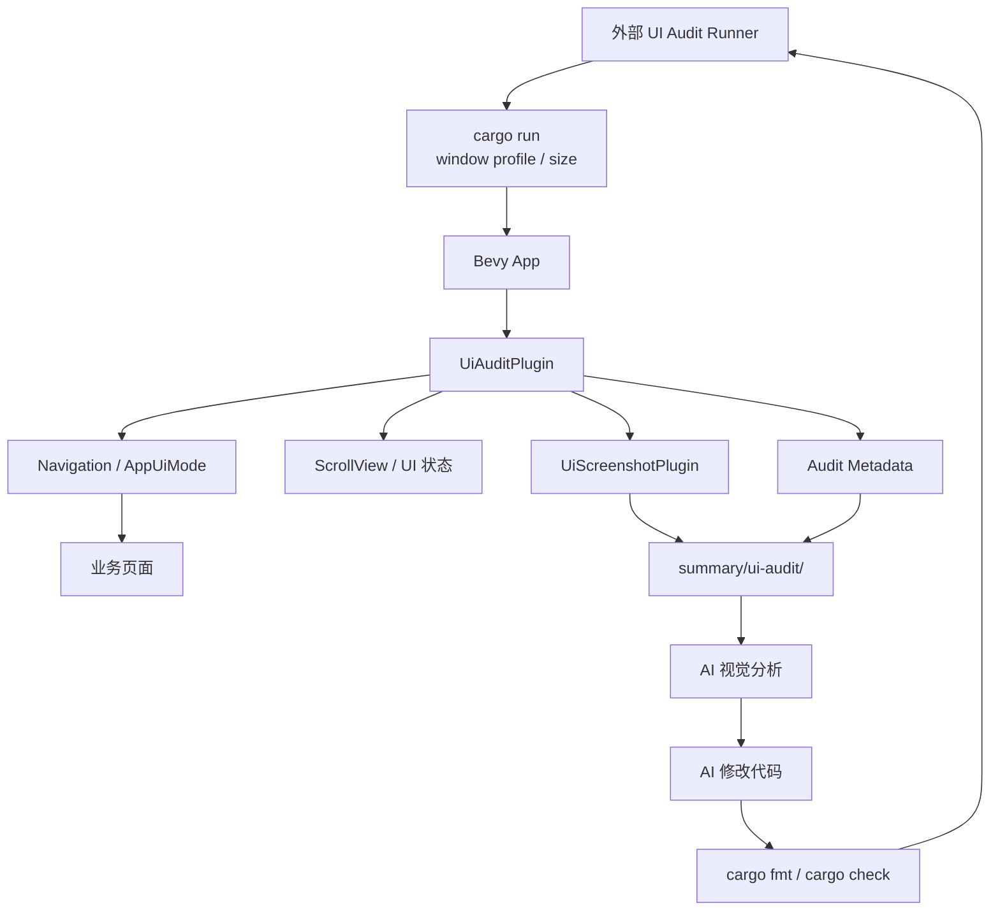

# UI 自动化审计与优化方案

本文档描述一个面向当前 Rust / Bevy 项目的 UI 自动化审计与优化机制。该机制采用“方案 B”：在游戏内实现审计模式，由 Bevy App 自己进入目标界面、控制 UI 状态、执行滚动、截图并输出元数据，再把证据交给 AI 分析和修复。

## 文档状态

本文是“已落地能力 + 后续设计”的混合文档。当前已经落地的 UI 审计能力包括：

- `AppUiMode`：游戏层页面模式。
- `TOUCH_START_SCREEN`：桌面开发时直达目标页面。
- `--window-profile`、`--window-size`、`--window-scale`：桌面窗口和设备尺寸模拟。
- `UiViewport`、`UiMetrics`、`UiPanelRoot`、`UiLayerRoot`、`UiInputState`、`UiFocusState`、`UiStats`：UI 框架可观测数据。
- F3 调试面板：可观察 viewport、panel、input、UI tree 和 layout bounds。
- F9 手动主窗口截图，默认保存到 `summary/ui-audit/manual/`。
- `UiScreenshotCommand` / `UiScreenshotEvent` 命令式截图 API。
- 本地一次性 `MYBEVY_UI_AUDIT_*` 审计模式，支持自动进入页面、等待稳定、滚动 recipe、截图、metadata、manifest 和 report。
- `scripts/run-ui-audit.ps1` 本地 runner，支持 screen / device 矩阵、dry-run、rerun、fixture 分析和默认关闭的 FixMode。
- `scripts/run-ui-audit.ps1` 远程 Mock / Http runner，按本文和远程调试文档约定的 adminapi 任务接口创建命令、轮询状态并汇总 artifact。
- AI 分析 fixture 分级：`severe` / `medium` 作为阻塞，`minor` 只记录。
- FixMode `Off` / `Plan` / `Mock` / `Command` 修复闭环骨架，包含安全策略、before / after iteration、`cargo fmt` / `cargo check` 检查记录和失败出口。

仍属于设计或外部依赖的部分：

- 真实远程 server / client 调试命令执行链路尚未在本仓库内接入；Http runner 只按文档接口调用外部 `adminapi`。
- Android 真机截图、系统 UI 截图、第二窗口截图和 offscreen render target 截图尚未实现。
- AI 视觉模型调用尚未内置；当前 runner 支持关闭分析、fixture 分析，以及供外部 AI 消费的 `analysis-input.json`。
- 多语言、字体缩放、软键盘、安全区真机矩阵、视觉 diff 和 CI 夜间全量策略仍是长期扩展。

## 目标

目标是实现一个可自动闭环的 UI 优化流程：

1. 输入一个界面列表，列表可以只有一个界面，也可以是全量界面。
2. 程序按常见手机、平板、桌面分辨率和长宽比启动目标界面。
3. 游戏内自动等待页面稳定，执行全屏截图。
4. 对有滚动内容的界面，自动滚动到顶部、中段、底部等位置并截图。
5. 保存每个界面、设备、状态对应的截图和元数据。
6. 将截图和元数据交给 AI 分析布局、文字大小、裁切、重叠、可读性、触控区域和层级关系。
7. 如果 AI 发现问题，允许 AI 直接修改当前项目 UI 代码。
8. 修改后重新运行同一批检查。
9. 所有目标界面在所有目标分辨率和滚动状态下无异常后，生成总结文档并关联截图。

## 非目标

第一阶段不追求构建通用 UI SaaS、跨项目 Storybook 或独立渲染器。该机制限定在当前项目框架内工作，不脱离 Bevy UI、现有 `AppUiMode`、页面插件和 UI framework。

第一阶段也不要求 AI 追求主观审美最优。自动闭环优先解决阻塞级和明显体验问题，例如文字重叠、裁切、不可读、不可点击和关键内容不可达。

## 核心思路

方案 B 的关键是：游戏程序进入“审计模式”后，自己成为可控测试员。

普通运行流程是：

```text
cargo run
用户手动进入页面
用户观察 UI
用户截图
```

审计运行流程是：

```text
cargo run -- audit 参数
游戏自动进入目标页面
游戏等待 UI 稳定
游戏自动切换状态或滚动
游戏自动全屏截图
游戏写入截图元数据
游戏退出或进入下一个审计状态
```

外部 runner 可以继续负责批量启动不同分辨率、调用 AI、触发代码修改和复跑，但不负责猜测游戏窗口内部状态。窗口内部的页面状态、滚动状态和截图时机由游戏内 `UiAuditPlugin` 控制。

## 总体架构



建议拆分为两个内部能力：

- `UiScreenshotPlugin`：负责主窗口全屏截图、截图保存和截图完成事件。
- `UiAuditPlugin`：负责审计配置、页面进入、稳定等待、滚动状态、截图编排和元数据输出。

如果截图未来会被 UI 以外的功能使用，可以放在 `project/src/framework/screenshot/`。如果只服务 UI 审计，可以放在 `project/src/framework/ui/audit/` 内部。

## 启动方式

本地审计通过环境变量和窗口参数启动一个一次性审计进程。远程设备、移动端和多 client 审计通过 `docs/debug/远程调试控制机制.md` 描述的 adminapi 任务模型编排；当前仓库内的远程 runner 已有 Mock 和 Http 两种后端，但真实 server / client 执行能力仍是外部依赖。

审计模式通过环境变量或命令行参数启用。建议优先使用环境变量，避免和现有 Bevy 参数冲突。

示例：

```powershell
Set-Location project
$env:MYBEVY_UI_AUDIT="1"
$env:MYBEVY_UI_AUDIT_SCREEN="gallery"
$env:MYBEVY_UI_AUDIT_OUTPUT="..\summary\ui-audit\2026-06-26-153000"
cargo run -- --window-profile phone-small --window-scale 50%
```

建议支持的环境变量：

```text
MYBEVY_UI_AUDIT=1
MYBEVY_UI_AUDIT_SCREEN=gallery
MYBEVY_UI_AUDIT_OUTPUT=../summary/ui-audit/<run-id>
MYBEVY_UI_AUDIT_STATES=top,middle,bottom
MYBEVY_UI_AUDIT_EXIT_ON_FINISH=1
```

其中：

- `MYBEVY_UI_AUDIT`：启用审计模式。
- `MYBEVY_UI_AUDIT_SCREEN`：目标界面 alias，复用 `TOUCH_START_SCREEN` 的页面命名规则。
- `MYBEVY_UI_AUDIT_OUTPUT`：本轮审计输出目录。
- `MYBEVY_UI_AUDIT_STATES`：目标状态列表，当前支持 `image_fit`、`visual_foundation`、`image_modes`、`image_tiling`、`image_atlas`、`top`、`middle`、`bottom`、`initial`。其中前两项是 UI Gallery 顶部固定区域，三个高级图片状态使用命名 child anchor 分段定位。
- `MYBEVY_UI_AUDIT_EXIT_ON_FINISH`：审计完成后自动退出进程，方便外部 runner 批量执行。

窗口尺寸继续复用现有参数：

```powershell
cargo run -- --window-profile phone-portrait
cargo run -- --window-profile phone-1080p
cargo run -- --window-profile phone-small
cargo run -- --window-profile tablet-portrait
cargo run -- --window-profile tablet-landscape
cargo run -- --window-size 1366x768 --device-scale 1.0
```

日常建议优先使用仓库根目录的 runner：

```powershell
.\scripts\run-ui-audit.ps1 -SelfTest
.\scripts\run-ui-audit.ps1 -Screens ui-gallery -Devices phone-small,tablet-landscape -States auto
.\scripts\run-ui-audit.ps1 -Screens ui-gallery -Devices phone-small,tablet-landscape -States "top,middle,bottom" -DryRun
```

`-DryRun` 只验证 screen / device / state 矩阵、输出 `manifest.json`、`analysis-input.json`、`analysis.json` 和 `report.md`，不会启动 `cargo run`，也不会生成真实截图。真实本地运行会为每个 screen + device 创建一次 `cargo run`，设置 `MYBEVY_UI_AUDIT_*` 并把 stdout / stderr 写入本轮 `logs/`。

远程 Mock 演示：

```powershell
.\scripts\run-ui-audit.ps1 -Remote -RemoteBackend Mock -DeviceId android-test-01 -Screens ui-gallery -States top
```

远程 Http 模式会调用外部 adminapi：

```powershell
.\scripts\run-ui-audit.ps1 -Remote -RemoteBackend Http -AdminApiBaseUrl http://127.0.0.1:8080 -AdminApiToken <token> -DeviceId android-test-01 -Screens ui-gallery -States top
```

## 控制通道演进

UI 自动化审计需要两种控制通道分阶段存在：

1. 本地一次性审计模式：通过 `MYBEVY_UI_AUDIT_*` 环境变量启动游戏进程，client 在启动后自动进入页面、滚动、截图、写入结果并退出。该模式适合第一阶段本地开发、桌面窗口 profile 和 CI 兜底。
2. 远程调试控制模式：通过 `adminapi` 创建调试任务，server 通过 `game-server` 向指定 client 下发命令，client 在 Bevy 主线程执行命令并回传结果。该模式适合 Android 真机、多设备、多 client、AI 交互式审计和未来其他自动化功能。

长期推荐以远程调试控制模式作为主通道。UI 审计文档只定义“要执行哪些 UI 审计动作和如何分析结果”；跨设备命令下发、任务状态、错误码、超时、重试、artifact 和安全边界以 `docs/debug/远程调试控制机制.md` 为准。

当前实际优先级是：

1. 本地 runner：桌面开发和 CI fallback，直接依赖 `MYBEVY_UI_AUDIT_*`。
2. 远程 Mock runner：验证 adminapi 任务编排、artifact 汇总、失败报告和 AI 输入格式。
3. 远程 Http runner：对接外部 `adminapi`，但是否能真正控制设备取决于外部 server / client 是否实现了调试通道。

## 设备矩阵

当前 runner 支持项目已有 profile 作为基础矩阵；`-Devices all` 会展开为全部基础设备：

| 设备类型 | profile |
| --- | --- |
| 桌面 | `desktop` |
| 小屏手机 | `phone-small` |
| 常见竖屏手机 | `phone-portrait` |
| 1080p 竖屏手机 | `phone-1080p` |
| 平板竖屏 | `tablet-portrait` |
| 平板横屏 | `tablet-landscape` |

扩展矩阵可以用 `--window-size` 覆盖更细设备：

| 类型 | 参考尺寸 |
| --- | --- |
| 低端窄屏手机 | `360x640` 逻辑尺寸等价配置 |
| 常见手机 | `390x844` 逻辑尺寸等价配置 |
| 平板竖屏 | `768x1024` 逻辑尺寸等价配置 |
| 平板横屏 | `1024x768` 逻辑尺寸等价配置 |
| 笔记本 | `1366x768` |
| 桌面 | `1920x1080` |

为了避免第一版成本爆炸，基础矩阵先覆盖现有 profile。AI 修复闭环稳定后，再引入扩展矩阵和压力尺寸。

runner 的 `-WindowProfile`、`-WindowSize`、`-DeviceScale`、`-WindowScale` 和 `-BevyArgs` 可追加窗口覆盖参数；常规矩阵仍以 `-Devices` 为主。

## 支持的 Screen Alias

当前 runner 和游戏内审计注册的 screen alias 保持一致：

| canonical | aliases |
| --- | --- |
| `login` | `login` |
| `lobby` | `lobby`, `game_list`, `game-list`, `list` |
| `audio_settings` | `audio_settings`, `audio-settings`, `audio`, `settings` |
| `audio_monitor` | `audio_monitor`, `audio-monitor`, `audio_debug`, `audio-debug` |
| `audio_gallery` | `audio_gallery`, `audio-gallery` |
| `wanfa_touch_ripple` | `wanfa_touch_ripple`, `wanfa-touch-ripple`, `touch`, `touch_ripple`, `touch-ripple` |
| `ui_gallery` | `ui_gallery`, `ui-gallery`, `gallery` |
| `sample_scene` | `sample_scene`, `sample-scene`, `sample` |
| `robot_sync_scene` | `robot_sync_scene`, `robot-sync-scene`, `robot` |
| `fangyuan_home` | `fangyuan_home`, `fangyuan-home`, `fangyuan` |

`-Screens all` 或 `-Screens full` 会展开全部 canonical screen。

## 内置全屏截图能力

全屏截图是整个审计机制的第一块基础设施。它应当支持手动触发和命令触发。

### 手动截图

已实现 `F9` 手动截图。debug 桌面构建默认启用，Android 和 wasm 默认禁用；可通过 `MYBEVY_UI_AUDIT_MANUAL_SCREENSHOT=0/1` 覆盖。

```text
运行游戏
进入任意 UI
按 F9
保存当前主窗口全屏 PNG
日志输出保存路径
```

默认保存目录：

```text
summary/ui-audit/manual/
```

可通过 `MYBEVY_UI_AUDIT_MANUAL_OUTPUT` 覆盖保存目录。文件名包含 Unix 秒级时间戳、当前 UI owner、逻辑尺寸和物理尺寸。

建议文件名包含：

```text
<timestamp>_<screen>_<logical-width>x<logical-height>.png
```

手动截图的价值是先验证渲染管线、主窗口截图、PNG 编码和文件落盘可靠，再进入复杂的自动化流程。

### 命令式截图

审计模式通过 Bevy message 请求截图。当前接口形态：

```rust
pub enum UiScreenshotCommand {
    Capture {
        path: PathBuf,
        label: String,
    },
}
```

截图完成后发送事件：

```rust
pub enum UiScreenshotEvent {
    Saved(UiScreenshotSaved),
    Failed(UiScreenshotFailed),
}
```

审计状态机只依赖事件，不假设截图请求在同一帧同步完成。

### 截图元数据

每张截图应同时生成结构化元数据：

```json
{
  "screen": "gallery",
  "device": "phone-small",
  "state": "bottom",
  "screenshot": "screenshots/gallery/phone-small/02-bottom.png",
  "viewport": {
    "logical_width": 360,
    "logical_height": 800,
    "device_width": 720,
    "device_height": 1600,
    "device_scale": 2.0,
    "preview_scale": 0.5
  },
  "panels": [
    "ui_gallery_page"
  ],
  "scroll": {
    "main": {
      "offset": 1240.0,
      "max_offset": 1240.0,
      "position": "bottom"
    }
  }
}
```

AI 分析时应同时读取截图和元数据。这样 AI 不只看图，还能知道页面、分辨率、滚动状态、panel 层级和 viewport 信息。

## UiAuditPlugin

`UiAuditPlugin` 是游戏内审计模式入口。它只应在开发期启用，并且默认不影响普通游戏运行。

建议职责：

- 读取审计环境变量或启动参数。
- 把目标 screen alias 解析为 `AppUiMode`。
- 设置 `NextState<AppUiMode>` 进入目标页面。
- 等待页面和 UI layout 稳定。
- 按 recipe 执行状态切换、滚动或覆盖层打开。
- 发出截图命令。
- 收集截图事件和 UI 元数据。
- 输出 `manifest.json`、单张截图元数据和基础报告。
- 审计完成后按配置自动退出。

## 审计状态机

审计流程应显式建模为状态机，避免用固定 sleep 和输入模拟碰运气。

建议状态：

```text
Disabled
ReadConfig
EnterScreen
WaitForScreen
WaitForStable
PrepareCaptureState
WaitForStateStable
RequestScreenshot
WaitForScreenshot
RecordResult
NextCaptureState
WriteSummary
Finish
Failed
```

典型流程：

1. `ReadConfig`：读取 `MYBEVY_UI_AUDIT_*`。
2. `EnterScreen`：设置目标 `AppUiMode`。
3. `WaitForScreen`：确认目标页面根 panel 已存在。
4. `WaitForStable`：等待若干帧，并确认 UI 统计或 layout bounds 不再变化。
5. `PrepareCaptureState`：切换到 `top`、`middle`、`bottom` 或其他审计状态。
6. `WaitForStateStable`：等待滚动、弹窗、文本和布局稳定。
7. `RequestScreenshot`：发送 `UiScreenshotCommand::Capture`。
8. `WaitForScreenshot`：等待 `Saved` 或 `Failed` 事件。
9. `RecordResult`：写入截图元数据。
10. `NextCaptureState`：还有状态则继续，否则进入总结。
11. `WriteSummary`：输出 manifest 和基础报告。
12. `Finish`：自动退出或停留在页面。

## 页面 recipe

不同页面需要不同审计状态。建议引入轻量 recipe，而不是让审计系统猜测每个页面怎么操作。

示例：

```ron
(
  screen: "gallery",
  mode: "ui_gallery",
  captures: [
    (name: "top", scroll: Some((target: "main", position: Top))),
    (name: "middle", scroll: Some((target: "main", position: Middle))),
    (name: "bottom", scroll: Some((target: "main", position: Bottom))),
  ],
)
```

当前 recipe 写在 Rust 代码中，避免新增资源加载和错误处理。稳定后可以迁移为 RON：

```text
project/assets/ui/audit/screens.ron
```

页面 recipe 至少描述：

- screen alias。
- 对应 `AppUiMode`。
- 需要截图的状态。
- 每个状态需要滚动到哪个目标和位置。
- 是否需要打开 Confirm、Loading、Floating 等覆盖层。
- 是否需要等待特定页面 ready marker。

当前已支持的滚动 recipe：

| screen | scroll target | states |
| --- | --- | --- |
| `ui_gallery` | `ui_gallery.main` | `image_fit`, `visual_foundation`, `image_modes` / `image_tiling` / `image_atlas`（同名 `ui_gallery.*` anchor）, `top`, `middle`, `bottom` |

其他 screen 默认只有 `initial`。如果对没有 recipe 的 screen 显式请求任一图片 state、`top`、`middle` 或 `bottom`，本地审计会失败并写出 `config_invalid`。远程 runner 会按约定发送 `<screen>.main` 作为滚动目标，真实能否执行取决于远程 client 是否注册对应稳定 ID。

## 滚动检查

有滚动内容的界面不能只检查首屏。审计模式需要程序化滚动。

黑盒滚动方式是模拟鼠标滚轮：

```text
鼠标移到窗口中央
滚轮滚动 N 次
截图
```

这种方式不稳定，因为焦点、鼠标位置、scroll 容器嵌套和窗口大小都会影响结果。

方案 B 推荐在 UI 框架内支持可审计滚动目标：

```rust
pub struct UiAuditTarget {
    pub id: UiAuditTargetId,
}
```

或者给 ScrollView 增加专用 ID：

```rust
pub struct UiScrollAuditId(pub String);
```

审计系统通过 ID 找到目标 ScrollView，然后设置滚动位置：

```text
Top = 0%
Middle = 50%
Bottom = 100%
```

每次滚动后等待布局稳定，再截图。

滚动元数据应记录：

- scroll target ID。
- 当前 offset。
- 最大 offset。
- viewport height。
- content height。
- 是否确实到达目标位置。

如果 recipe 声明了滚动目标，但运行时找不到对应 ScrollView，本次审计应失败，而不是静默跳过。

## 页面稳定判定

截图前需要确认 UI 已稳定，否则可能截到中间态。

可组合以下条件：

- 目标 `UiPanelRoot` 已生成。
- `State<AppUiMode>` 已经等于目标页面。
- 等待最少帧数，例如 3 到 5 帧。
- `UiStats` 连续若干帧不变化。
- 关键 layout bounds 连续若干帧不变化。
- 页面可选提供 `UiAuditReady` marker。
- 图片、字体或绑定数据没有处于明显 loading 状态。

第一阶段可以采用简单规则：

```text
目标页面 panel 存在后，再等待 5 帧，然后截图。
```

后续再逐步增强为 layout 稳定和页面 ready marker。

## 输出目录

每次完整审计生成独立目录：

```text
summary/ui-audit/<run-id>/
  manifest.json
  report.md
  analysis-input.json
  analysis.json
  screenshots/
    gallery/
      phone-small/
        00-top.png
        01-middle.png
        02-bottom.png
      tablet-landscape/
        00-top.png
        01-middle.png
        02-bottom.png
  metadata/
    gallery/
      phone-small/
        00-top.json
        01-middle.json
        02-bottom.json
```

runner 输出会额外包含：

```text
summary/ui-audit/<run-id>/
  logs/
    <screen>__<device>.stdout.log
    <screen>__<device>.stderr.log
  runs/
    <screen>/
      <device>/
        manifest.json
        report.md
  iterations/
    00-before/
    01-after-fix/
```

远程 Mock / Http 模式会在 task/capture 中记录 `task_id`、`request_id`、`remote_task_ids`、`screenshot_artifact_uri`、`metadata_artifact_uri` 和可选 `log_artifact_uri`。Mock 后端还会在 run 目录下写入本地 `artifacts/<task-id>/` 文件，便于演示。

`summary/ui-audit/` 被仓库根目录 `.gitignore` 的 `/summary/*` 规则忽略。常规审计产物不提交 Git；需要分享时应复制必要的 `report.md`、`manifest.json`、`analysis*.json` 和截图到明确的文档附件位置，或在 PR / 任务系统中引用外部 artifact。清理旧产物时删除 `summary/ui-audit/<run-id>/` 或整个 `summary/ui-audit/` 即可，保留 `summary/.gitkeep`。

`manifest.json` 记录本轮任务：

```json
{
  "run_id": "2026-06-26-153000",
  "screens": ["gallery"],
  "devices": ["phone-small", "tablet-landscape"],
  "captures": [
    {
      "screen": "gallery",
      "device": "phone-small",
      "state": "top",
      "screenshot": "screenshots/gallery/phone-small/00-top.png",
      "metadata": "metadata/gallery/phone-small/00-top.json",
      "status": "captured"
    }
  ]
}
```

`report.md` 面向人阅读，必须关联截图：

```markdown
# UI Audit Report

## gallery / phone-small

- top: passed  
  screenshot: screenshots/gallery/phone-small/00-top.png
- middle: passed  
  screenshot: screenshots/gallery/phone-small/01-middle.png
- bottom: passed  
  screenshot: screenshots/gallery/phone-small/02-bottom.png
```

如果发生修复，建议保留 before / after：

```text
summary/ui-audit/<run-id>/
  iterations/
    00-before/
    01-after-fix/
```

## AI 分析输入

AI 不应只接收截图。每个分析任务应包含：

- 截图 PNG。
- 单张截图元数据 JSON。
- 本轮 manifest。
- 目标页面名称。
- 设备 profile 或窗口尺寸。
- 滚动状态。
- 当前代码相关文件提示，可由 screen recipe 提供。

当前 runner 会生成 `analysis-input.json`，每条 capture 至少包含 `screen`、`device`、`state`、截图/metadata 路径或远程 artifact URI、`manifest`、`likely_files`。fixture 分析结果必须引用已有 capture 的 `screen + device + state`，否则 runner 会报告分析结果非法。

示例结构：

```json
{
  "screen": "gallery",
  "device": "phone-small",
  "state": "bottom",
  "screenshot": "screenshots/gallery/phone-small/02-bottom.png",
  "metadata": "metadata/gallery/phone-small/02-bottom.json",
  "likely_files": [
    "project/src/game/screens/dev/ui_gallery.rs",
    "project/src/framework/ui/widgets/scroll.rs",
    "project/src/framework/ui/style/theme.rs"
  ]
}
```

## AI 问题分级

自动闭环必须有明确分级，否则 AI 容易反复追求主观美观。

严重问题：

- 文字重叠。
- 文字被关键裁切。
- 按钮不可见或不可点击。
- 关键内容跑出屏幕。
- 弹窗层级错误。
- 滚动到底仍有关键内容不可达。
- UI 遮挡 gameplay 或反向穿透输入。

中等问题：

- 文本过小或明显不可读。
- 间距过度拥挤。
- 列表项高度不稳定。
- 触控目标明显过小。
- 页面主次层级混乱，影响使用。

轻微问题：

- 对齐可以更整齐。
- 文案换行不够优雅。
- 颜色或间距有主观优化空间。

第一阶段通过标准建议是：严重问题和中等问题为 0。轻微问题可以记录，但不阻塞自动通过。

## AI 修复策略

AI 修复应遵循由局部到全局的顺序：

1. 优先改目标页面局部布局，例如 padding、gap、flex direction、scroll 容器、文本 wrap。
2. 其次改通用控件参数，例如按钮最小高度、文本换行、输入框高度。
3. 再考虑主题 token，例如字号、间距、圆角。
4. 最后才改 UI 框架底层布局或输入机制。

每次修复后必须重新运行相关截图任务。修复一个页面时，不应只复查失败分辨率；至少要复查该页面完整设备矩阵，防止窄屏修复破坏横屏或桌面。

AI 修复循环必须设置最大迭代次数，例如：

```text
max_fix_iterations = 5
```

超过次数仍未通过时，输出失败报告并保留最后一轮截图和问题列表。

当前 FixMode 默认 `Off`。`Plan` 只生成修复计划，不修改代码；`Mock` 只记录模拟修复并运行检查；`Command` 会执行 `-FixCommand`，但必须通过安全策略。允许优先级为页面局部布局、通用控件、主题 token、UI framework core；禁止修改 `summary/ui-audit/`、构建产物、敏感配置和允许根之外的文件。每轮会记录 `iterations/00-before/` 和 `iterations/NN-after-fix/`，并在报告中链接 before / after snapshot、cargo 日志和 after report。

## 外部 Runner 的职责

虽然方案 B 把页面控制和截图放进游戏内，但仍需要外部 runner 编排批量任务。第一阶段 runner 可以通过环境变量启动一次性审计进程；远程调试控制机制完成后，runner 应改为调用 `adminapi` 创建任务并查询结果。

外部 runner 负责：

- 接收界面列表。
- 展开设备矩阵。
- 本地模式下，为每个 screen + device 启动一次游戏进程，设置 `MYBEVY_UI_AUDIT_*` 环境变量，并传入 `--window-profile` 或 `--window-size`。
- 远程模式下，通过 `adminapi` 选择目标 device/client，按任务模型下发 `ui.goto_screen`、`ui.wait_stable`、`ui.scroll_to`、`ui.screenshot`、`ui.read_tree` 等命令。
- 等待本地进程完成，或轮询远程 debug task 状态。
- 汇总 manifest。
- 调用 AI 分析截图。
- 如果有问题，触发代码修复。
- 运行 `cargo fmt` 和 `cargo check`。
- 复跑失败页面或完整相关矩阵。
- 生成最终总结文档。

游戏内 `UiAuditPlugin` 负责可靠地执行 UI 状态控制、滚动、截图和 metadata 采集；外部 runner 负责多页面、多分辨率、多设备和多轮修复。远程模式下，命令通道、任务状态和 artifact 回收由 `docs/debug/远程调试控制机制.md` 约定。

## 通过标准

一次 UI 审计最终通过需要满足：

- 所有输入界面均完成目标设备矩阵。
- 每个 screen + device + state 都有截图文件。
- 每张截图都有对应元数据。
- 有滚动内容的界面至少覆盖顶部、中段、底部，或覆盖 recipe 声明的全部状态。
- AI 分析结果中严重问题为 0。
- AI 分析结果中中等问题为 0。
- 如果发生代码修改，`cargo fmt` 和 `cargo check` 通过。
- 最终 `report.md` 完整关联所有通过截图。
- 修复前后关键截图被保留，便于追溯。

## 失败类型

审计失败应明确分类：

| 类型 | 含义 |
| --- | --- |
| `launch_failed` | 游戏进程启动失败 |
| `timeout` | 本地 cargo 进程超过 runner 超时 |
| `manifest_missing` | 子进程未写出 manifest |
| `manifest_invalid` | 子进程 manifest 不是合法 JSON 或结构不符合预期 |
| `output_missing` | manifest 存在，但截图或 metadata 文件缺失 |
| `screen_not_found` | 无法进入目标页面 |
| `panel_not_ready` | 目标页面根 panel 未出现 |
| `unstable_ui` | 等待超时后 UI 仍不稳定 |
| `scroll_target_missing` | recipe 声明的滚动目标不存在 |
| `scroll_target_unreachable` | 无法滚动到目标位置 |
| `screenshot_failed` | 截图请求失败或文件未生成 |
| `artifact_upload_failed` | 远程截图任务成功但缺少 screenshot 或 metadata artifact URI |
| `remote_error` / `remote_failed` / `remote_status_unknown` | 远程任务返回未知错误、普通失败或未知状态 |
| `device_offline` / `debug_disabled` / `send_failed` / `client_timeout` / `client_rejected` | 远程 runner 已知错误码 |
| `ai_blocking_issue` | AI 发现严重或中等问题 |
| `ai_missing_capture` / `ai_missing_capture_metadata` / `ai_remote_artifact_read_failed` | AI 分析输入不完整 |
| `ai_result_invalid` | fixture/外部分析结果格式非法或无法对应 capture |
| `safety_policy_rejected` | 修复候选路径或实际变更不符合安全策略 |
| `fix_check_failed` | AI 修改后格式化或编译检查失败 |
| `max_iterations_reached` | 达到最大修复次数仍未通过 |

失败报告应包含失败类型、页面、设备、状态、截图或日志路径。

当前 runner 的 `manifest.json` 和 `report.md` 会在 task 表中记录 `screen`、`device`、`states`、`failure_type`、stdout/stderr 或 remote task id；capture 表中记录 `screen`、`device`、`state`、截图、metadata、artifact URI 和 failure。分析 issue 表也按 `screen + device + state` 反向关联截图和 metadata。

## 建议落地顺序

### 阶段 1：全屏截图基础能力

实现 `F9` 手动全屏截图，保存到 `summary/ui-audit/manual/`，并输出成功或失败日志。

验收重点：

- 任意页面可截图。
- 截图文件真实落盘。
- 文件名包含时间和窗口信息。
- 不影响普通游戏输入。

### 阶段 2：命令式截图 API

新增 `UiScreenshotCommand` 和 `UiScreenshotEvent`，允许系统请求截图并等待完成事件。

验收重点：

- 不依赖按键。
- 成功和失败都有事件。
- 调用方不需要知道渲染细节。

### 阶段 3：单页面审计模式

新增 `UiAuditPlugin`，支持一个 screen、一个 device、一个 initial 截图状态。

验收重点：

- 可通过环境变量进入审计模式。
- 自动进入目标 `AppUiMode`。
- 等待页面稳定。
- 自动截图。
- 写入 manifest 和 metadata。
- 可选自动退出。

### 阶段 4：滚动状态和页面 recipe

为可滚动页面增加稳定 scroll target ID，支持 top / middle / bottom 截图。

验收重点：

- UI Gallery 这类长页面能覆盖顶部、中段、底部。
- 找不到滚动目标会失败。
- metadata 记录滚动位置。

### 阶段 5：外部 runner 和报告

实现批量 runner，展开 screen list 和 device matrix，汇总报告。

验收重点：

- 输入一个界面或全量界面都可运行。
- 每个截图都关联到报告。
- 失败能定位到 screen + device + state。

### 阶段 6：AI 分析和修复闭环

把截图、metadata、manifest 交给 AI 分析。发现阻塞问题时修改代码、运行检查并复跑。

验收重点：

- 问题按严重、中等、轻微分级。
- 严重和中等问题阻塞通过。
- 修复后 `cargo fmt` 和 `cargo check` 通过。
- before / after 截图可追溯。

## 代码边界建议

推荐目录：

```text
project/src/framework/ui/audit/
  mod.rs
  plugin.rs
  config.rs
  driver.rs
  screenshot.rs
  recipe.rs
  metadata.rs
```

如果截图能力希望独立于 UI：

```text
project/src/framework/screenshot/
  mod.rs
  plugin.rs
  command.rs
  writer.rs
```

游戏层可以只提供页面 recipe 或页面 ready marker：

```text
project/src/game/screens/dev/ui_gallery.rs
project/src/game/screens/lobby/game_list.rs
```

框架层不应直接依赖具体业务页面。具体页面 ID、owner、recipe 可以由游戏层注册到审计框架。

## 维护约束

- 审计能力默认关闭，普通运行不应产生截图、报告或自动退出。
- 审计代码不能绕过现有 `AppUiMode` 和 panel 管理机制。
- 审计截图和报告应写入 `summary/ui-audit/`，不要写入 `project/assets/`。
- 截图、metadata、manifest、analysis、report、logs 和 iterations 属于审计产物，默认被 Git 忽略，不纳入正式代码提交。
- 清理旧产物时只删除 `summary/ui-audit/<run-id>/` 或 `summary/ui-audit/`，不要删除 `summary/.gitkeep`，也不要把 checklist 归档流程混入 runner 清理。
- 修复 UI 时优先保持局部变更，避免为单一分辨率破坏通用控件。
- 自动修复必须保留最大迭代次数和失败出口。

## 当前不支持的场景

- 第二窗口或 F7 专用调试窗口截图；当前截图目标是 primary window。
- offscreen render target、单独 UI 层或游戏世界层截图；当前保存最终主窗口合成画面。
- Android 真机截图和系统 UI 截图；safe area 仍需要真机手动观察或未来远程 client 支持。
- 系统状态栏、导航栏、软键盘、通知弹层等 OS UI 截图。
- 真实远程 server / client 命令执行；本仓库只有 runner 的 Mock 后端和 Http 调用端。
- 远程 `adminapi` 未实现 artifact 下载或本地落盘时，runner 只能记录 artifact URI，不能验证实际图片内容。
- 多窗口、多 client 同屏对比和跨设备视觉 diff。

## 长期扩展

长期可以增加：

- 弹窗态 recipe，例如 Confirm、Loading、Floating。
- 输入框聚焦态和软键盘遮挡检查。
- hover、pressed、disabled 等控件状态截图。
- Android 真机截图和 safe area 检查。
- 多语言文案矩阵，例如 `zh_cn` 和 `en_us`。
- 字体缩放矩阵。
- 截图视觉 diff。
- 历史趋势报告。
- CI 夜间全量审计，日常只审计变更相关页面。

这些扩展不改变核心方向：游戏内负责可靠地摆出 UI 状态并截图，外部 runner 和 AI 负责批量调度、分析、修复和复查。
